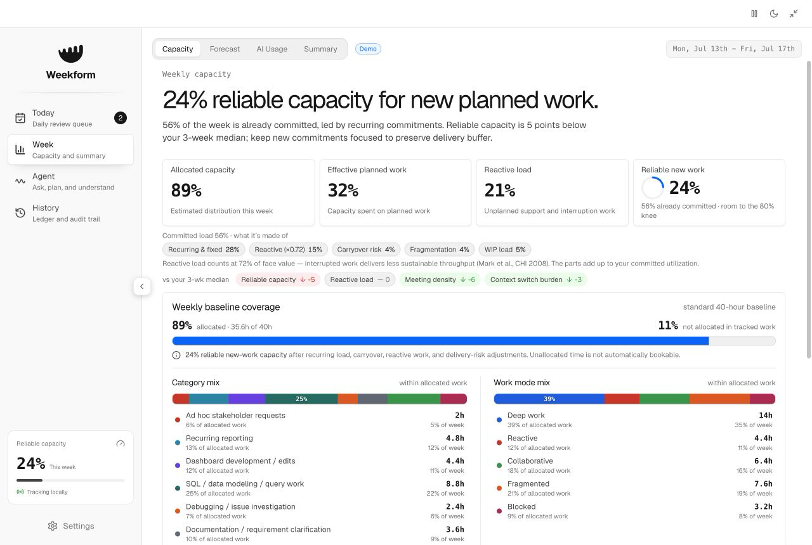

<p align="center">
  
</p>

<h1 align="center">Weekform</h1>

<p align="center"><strong>Know what fits before you commit.</strong></p>

<p align="center">
  A local-first macOS workload intelligence app for analysts.<br>
  Turn the work already happening across your week into reviewable evidence and reliable capacity.
</p>

<p align="center">
  <a href="#install-weekform">Install</a> ·
  <a href="#how-it-works">How it works</a> ·
  <a href="#privacy-by-design">Privacy</a> ·
  <a href="#try-the-demo">Demo</a> ·
  <a href="#development">Development</a> ·
  <a href="#openai-build-week-2026">Build Week</a>
</p>



<p align="center"><sub>Weekly capacity in Weekform. Every value shown above comes from synthetic demo data.</sub></p>

Weekform turns calendar events and foreground-app activity into work blocks you can confirm, relabel, or exclude. It then explains how much of the week is allocated, what is driving delivery risk, and how much new planned work can fit without likely slippage.

Every inference keeps its evidence. Every correction is auditable. AI assistance is optional and opt-in. Weekform is a private planning aid—not an employee-monitoring product.

> [!IMPORTANT]
> Weekform is an early prototype, not a production workforce-management system. Capacity estimates are planning aids and should be reviewed before they are shared or used for decisions.

---

## Install Weekform

Weekform currently builds from source on your Mac. The [guided installer](scripts/install.command) is the easiest path for first-time users: it checks the required tools, asks before installing anything missing, builds the app locally, and places **Weekform.app** in `/Applications`.

### Download and double-click

1. [Download the Weekform source](https://github.com/kspringfield13/weekform-dev/archive/refs/heads/main.zip) and unzip it.
2. In Finder, open `weekform-dev-main`, then `scripts`.
3. Double-click **`install.command`** and follow the prompts.

If macOS says the installer is from an unidentified developer, right-click `install.command`, choose **Open**, then confirm **Open**. You can also allow it once under System Settings → Privacy & Security.

### Clone and install from Terminal

```bash
git clone https://github.com/kspringfield13/weekform-dev.git
cd weekform-dev
bash scripts/install.command
```

Already have the repository? Run `bash scripts/install.command` from its root. Re-running the installer rebuilds and reinstalls the current checkout.

> [!NOTE]
> Weekform lives in the macOS menu bar rather than the Dock. When you first resume tracking, macOS may ask for Accessibility permission so the app can identify the foreground application and window title—never your keystrokes. Screen content is not captured unless you explicitly enable Visual Context.

The app is compiled locally, so this path does not require an Apple Developer signature. The installer downloads source dependencies and any prerequisites you approve; it does not upload Weekform activity data. AI features remain optional.

## How it works

Weekform follows a reviewable pipeline from raw signals to a capacity estimate:

```text
capture → sessionize → classify → review → model → summarize
```

1. **Capture limited signals locally.** Foreground-app metadata, Outlook `.ics` exports, metadata-only workplace-chat exports, and git-log exports can contribute evidence.
2. **Build candidate work blocks.** Contiguous activity becomes sessions with category, work mode, planned status, project, confidence, and source evidence.
3. **Keep the user in control.** Confirm, relabel, annotate, or exclude any inferred block before treating it as reviewed work.
4. **Model the week.** See allocation, reactive load, meeting density, fragmentation, carryover risk, and reliable headroom for new work.
5. **Explain the result.** Inspect the audit trail, ask the Agent questions, forecast next week, or draft an editable weekly summary.

### Product surfaces

| Area | What it is for |
| --- | --- |
| **Today** | Review the daily queue and approve or reject optional Review Copilot suggestions. |
| **Week** | Understand capacity, forecast next week, inspect AI usage, and prepare a weekly summary. |
| **Agent** | Ask questions about your workload and find evidence-cited opportunities to reclaim time. |
| **History** | Review the activity ledger, corrections, privacy events, and flagged visual captures. |

### Current capabilities

- Native macOS menu-bar app built with Tauri 2, React, TypeScript, and Rust
- Reviewable work blocks with confidence, evidence, project, category, mode, and status
- Explainable weekly capacity, forecast history, trends, and delivery-risk modifiers
- Outlook `.ics`, workplace-chat metadata, and git-log import paths
- Searchable activity and audit history, including every user correction
- Conversational workload Agent and a deterministic Acceleration engine for time-saving plays
- Optional AI-assisted classification, review suggestions, forecasts, narratives, and visual context
- Local JSON or CSV export, configurable retention, immediate pause, and prototype data reset

## Privacy by design

Raw activity data starts local and stays under the user's control. Network-backed features are optional and disclose when provider processing is involved.

- Active-window capture records the application name, front-window title, and timestamp—not keystrokes.
- Outlook, chat, and git exports are parsed locally. Workplace chat uses timestamps and counts, never message text.
- Work blocks, corrections, audit events, and settings are persisted locally with Tauri Store; the web and demo builds use browser storage as a fallback.
- Tracking can be paused immediately from the app or menu bar.
- Visual Context is disabled by default and rate-limited. When enabled, a screenshot can be sent to the selected AI provider; after a successful read, the app attempts to remove the temporary local image before the provider request. OpenAI requests use `store: false`.
- Other AI features run only when enabled or triggered and receive structured context for the requested workflow.
- Retention is user-controlled, and local data can be exported or reset from Settings.

Read [Privacy and Data Flow](docs/PRIVACY.md) before enabling activity capture or AI features.

## Try the demo

The demo uses synthetic data and never touches real user state:

```bash
npm ci
npm run demo
```

This opens the weekly-capacity view at `http://127.0.0.1:5173/?demo=1&screen=weekly`. Native capture, menu-bar behavior, and native AI commands are unavailable in the browser-only demo.

## How capacity is calculated

Weekform's deterministic model starts with the load that is already committed or likely to carry into the week:

```text
Committed utilization =
  recurring and fixed commitments
  + carryover risk
  + weighted reactive load
  + fragmentation penalty
  + work-in-progress penalty

Reliable new-work capacity = clamp(80 - committed utilization, 0, 40)
```

The model holds back delivery buffer as utilization approaches roughly 80% and caps new-work headroom at 40% to avoid over-promising on a sparse week. Reliable capacity is not “free time”; it is an estimate of how much new planned work the following week can absorb without likely slippage.

## Development

### Requirements

- macOS
- Node.js 20.19+ or 22.12+
- npm
- Rust toolchain for the desktop app
- An API key only for optional AI features; OpenAI is the recommended and fullest-featured path

### Web interface

```bash
npm ci
cp .env.example .env
npm run dev
```

Open `http://127.0.0.1:5173`. This is the fastest frontend loop, but native capture, menu-bar behavior, and native AI commands require the desktop app.

### Desktop app

Install Rust if needed, then run:

```bash
curl --proto '=https' --tlsv1.2 -sSf https://sh.rustup.rs | sh
npm run desktop:dev
```

To enable optional AI features at startup, add credentials to the ignored `.env` file:

```dotenv
OPENAI_API_KEY=your-api-key
OPENAI_MODEL=
OPENAI_VISION_MODEL=
```

The desktop scripts default `DEVELOPER_DIR` to Apple’s standalone Command Line Tools. Export it first if you want to build with a specific Xcode installation.

### Commands

| Command | Purpose |
| --- | --- |
| `npm run dev` | Start the Vite web interface on `127.0.0.1:5173` |
| `npm run demo` | Open the web interface with synthetic weekly data |
| `npm run build` | Type-check and build the production web bundle |
| `npm run preview` | Preview the production web build |
| `npm run desktop:dev` | Run the full Tauri desktop app |
| `npm run desktop:build` | Create a desktop release build |
| `npm run pricing:check` | Verify the checked-in AI model-pricing catalog |

If a native release build is memory-constrained, reduce Cargo parallelism:

```bash
CARGO_BUILD_JOBS=2 npm run desktop:build
```

### Validation

Run all three checks before opening a pull request:

```bash
npm run build
npm audit --audit-level=moderate
cargo check --manifest-path apps/desktop/src-tauri/Cargo.toml
```

`npm run build` is the authoritative type and bundle gate. There is not yet an automated test suite; focused tests for import parsing, session grouping, capacity calculations, and native command boundaries remain a project priority.

## Architecture

| Path | Responsibility |
| --- | --- |
| `apps/desktop/src/` | React interface, stateful hooks, local services, prompts, and schemas |
| `apps/desktop/src-tauri/` | Rust shell, native macOS capture, AI pass-through, and window management |
| `packages/domain/src/` | Shared workload, privacy, correction, and audit models |
| `packages/inference/src/` | Sessionization, capacity modeling, forecasts, and acceleration signals |
| `packages/integrations/src/` | Outlook `.ics`, chat metadata, git-log, and generic event importers |

`App.tsx` is the frontend source of truth. Shared TypeScript packages are imported directly through relative paths and compiled in place by TypeScript and Vite.

## Known limitations

- macOS is the only native platform currently supported.
- Prototype state is persisted locally with Tauri Store (or browser storage in web/demo mode) rather than an encrypted application database.
- Outlook integration requires a manual `.ics` export.
- Window titles can contain sensitive information and should be reviewed or excluded.
- AI features require network access and may incur provider costs.
- Visual Context captures the current screen, not only the active application window.
- Capacity weights and thresholds are prototype heuristics, not validated organizational benchmarks.
- The largest React and Rust modules still need further decomposition.

## OpenAI Build Week 2026

Weekform predates the July 13–21 submission period. The public submission distinguishes that inherited baseline from the product work completed during Build Week and records the relevant Codex/GPT-5.6 task evidence. See [Build Week provenance](docs/BUILD_WEEK_2026.md) for the baseline commit, dated change record, and required `/feedback` Codex Session ID.

## How We Built Weekform with Codex

During Build Week, Kyle Springfield worked with Codex powered by GPT-5.6 as a hands-on product, design, and engineering collaborator. Codex accelerated repository research, option generation, implementation, review, debugging, and validation; Kyle set the product constraints, selected the direction, evaluated the results, and made the final calls. The collaboration was iterative rather than one-shot: propose, inspect, build, run, critique, and refine.

The core workload prototype and the first naming exploration existed before July 13. The timeline distinguishes that foundation from selected new work and material refinements during the submission period; it does not claim the inherited product as Build Week output.

| Date | Where Codex and GPT-5.6 accelerated the work | Key product, engineering, and design decisions made by Kyle |
| --- | --- | --- |
| **Before Build Week — July 11** | GPT-5.6 reviewed the product positioning, explored names and marketing angles, recommended **Weekform**, developed the folded-workweek “W” metaphor, and produced image-generation briefs for a compact macOS mark. It also surfaced `weekform.com` when a preliminary WHOIS check returned no match at that time; this was an availability signal, not trademark clearance or proof of registration. | Kyle selected Weekform from the proposed directions, rejected the first logo treatment as not strong enough, and requested clearer toolbar- and iPhone-ready concepts. This ideation is disclosed as prior work, not Build Week output. |
| **July 13** | After the name was locked, Codex productionized the supplied identity across the interface, native shell, packages, documentation, installer, app icons, and menu-bar assets, then built and visually checked the result. | Kyle supplied the chosen concept and black logo artwork, directed the lockup and compact-header refinements, approved the final identity, and locked the message **“Know what fits before you commit.”** He also chose to frame Weekform as a private planning aid—not employee surveillance. |
| **July 13** | Codex moved rapidly through targeted reliability and accessibility fixes, including recurring-calendar handling, forecast boundaries, Review Copilot state, keyboard behavior, and screen-reader semantics. | Kyle kept explainability, reviewability, and local-first behavior as release constraints rather than trading them away for speed. |
| **July 14** | A primary GPT-5.6 Codex task integrated and extended the chosen identity within a coherent product refresh across the React app, Tauri shell, package metadata, icons, documentation, AI-usage experience, and supporting assets. Codex handled the repository-wide impact analysis and implementation loop while keeping the project buildable. | Kyle directed the toolbar and navigation hierarchy, reviewed the visual result in the running app, chose which workload and AI-usage information deserved prominence, and refined measured usage rather than accepting a more speculative chart. |
| **July 15** | Codex audited edge cases across imports, persistence, privacy boundaries, and generated data, then implemented focused fixes for calendar data, sensitive visual context, usage records, and chat exports. | Kyle maintained the rule that sensitive evidence stays constrained, generated output must be defensively parsed, and every important inference remains inspectable by the user. |
| **July 16** | Codex improved the compact menu-bar experience, added Agent-assisted actions for classification, forecasting, and narratives, and implemented focused interaction polish with reduced-motion fallbacks. | Kyle required consequential Agent actions to remain approval-gated and shaped the final compact layout and motion through visual feedback. |
| **July 18** | Codex performed the submission audit, reconstructed the dated evidence trail, prepared a reproducible installer, migrated the current AI SDK integration, removed retired provider paths, and ran the web, dependency, Rust, and desktop-build checks. In a [follow-up product-presentation task](docs/BUILD_WEEK_2026.md#readme-product-presentation), it also reframed the public README around the product, captured an authentic synthetic-data capacity view, and preserved the technical, privacy, and provenance record. | Kyle chose an OpenAI-first direction for the hackathon, a separate public repository, and a clean history that clearly separates prior work from submission-period work. He set the public presentation bar: lead with the Weekform identity, show the real weekly-capacity experience, and keep the result honest about prototype and licensing status. |

### What Codex changed about our workflow

- **Faster exploration:** GPT-5.6 could inspect the product and codebase together, turn positioning ideas into concrete UI and identity options, and test those ideas against implementation constraints.
- **Safer cross-cutting changes:** Codex traced a decision across TypeScript, Rust, Tauri configuration, package metadata, assets, privacy documentation, and installer behavior instead of treating each file as an isolated edit.
- **Shorter feedback loops:** Codex repeatedly paired implementation with type-checking, production builds, Rust checks, dependency audits, and review of the running interface.
- **More review capacity:** Focused Codex reviews surfaced accessibility, data-integrity, privacy, and edge-case issues while Kyle concentrated on product judgment and visual critique.

The primary Build Week project task for `/feedback` is **`019f6058-ca64-7510-bcc5-f9416f981036`**. The dated baseline, selected commit evidence, supporting Codex tasks, and current submission notes are maintained in [Build Week provenance](docs/BUILD_WEEK_2026.md).

## Contributing

See [CONTRIBUTING.md](CONTRIBUTING.md) for development and pull-request guidance. Please use GitHub issues for reproducible bugs, privacy concerns, and narrowly scoped feature proposals.

## License

An open-source license has not yet been selected. Until one is added, this repository is publicly viewable under standard copyright restrictions.
