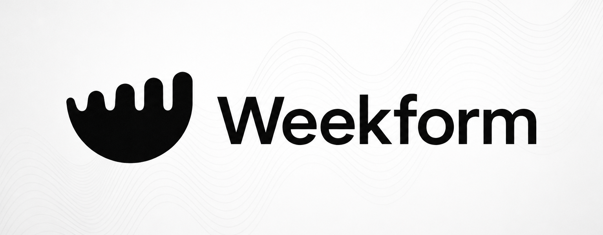

<p align="center">
  
</p>

<p align="center"><strong>Know what fits before you commit.</strong></p>

<p align="center">
  A local-first macOS workload intelligence app for individual analysts.<br>
  Turn the work that actually happened into reviewable evidence, understand what is putting delivery at risk, <br>
  and see how much new planned work can reliably fit next.
</p>

<p align="center">
  <a href="#the-moment-before-you-say-yes">Use case</a> ·
  <a href="#from-scattered-signals-to-a-defensible-decision">Core loop</a> ·
  <a href="#privacy-and-user-control">Privacy</a> ·
  <a href="#getting-started">Getting started</a> ·
  <a href="#development">Development</a> ·
  <a href="#how-we-built-weekform-with-codex">Built with Codex</a>
</p>


<p align="center"><sub>Weekly capacity view in Weekform</sub></p>

> [!IMPORTANT]
> Weekform is an early prototype. Its capacity estimates are deterministic planning aids, not validated performance science or employee evaluations. Review the underlying work before using an estimate to make or share a decision.

## The moment before you say yes

Weekform is for the moment someone asks: **Can you take this on next week?**

Calendars show scheduled time. Task trackers show intended work. Activity logs show fragments. None of them tells an analyst whether a new commitment will fit after recurring work, reactive requests, carryover, and fragmented focus have taken their share of the week.

Weekform turns limited local signals into work blocks the analyst can correct, then models the week so they can:

- decide whether a new project, analysis, or deadline can fit;
- explain why delivery or focus is at risk with evidence rather than intuition;
- separate planned progress from reactive load and recurring work;
- protect a realistic focus block before accepting more work; and
- learn whether forecasts and time-saving changes actually helped.

It is built first for individual analysts, with a path to other knowledge workers who face the same interruption-heavy planning problem. It is not a task-list replacement, a manual timesheet, a universal productivity score, or an employee-monitoring system.

### A concrete decision

In the synthetic demo, 56% of the week is already committed, 21% has been reactive, and the model leaves 24% reliable capacity for new planned work. A two-day analysis is roughly 40% of a standard week, so the useful answer is not “there are open calendar slots.” It is: **reduce the scope, move the date, or protect more capacity before committing.**

Reliable capacity is not “free time.” It is the amount of new planned work the model estimates the week can absorb while preserving a delivery buffer.

## From scattered signals to a defensible decision

```text
limited evidence → reviewed truth → deterministic workload model
→ evidence-grounded decision → approval-gated action → observed outcome
```

| Step | What Weekform does | Why it matters |
| --- | --- | --- |
| **Observe** | Uses limited calendar, foreground-app, import, and content-free attention signals. | Reconstructs the week without asking the user to maintain another timer. |
| **Review** | Turns activity into candidate work blocks that can be confirmed, relabeled, annotated, or excluded. | Inference never silently becomes truth. |
| **Model** | Calculates committed load, reactive load, fragmentation, carryover, and reliable new-work capacity. | The core answer is deterministic and inspectable. |
| **Decide** | Explains what fits, what is at risk, and which assumption drives the result. | A user can make a narrower commitment or defend a tradeoff. |
| **Act and learn** | Keeps proposed changes approval-gated, then compares forecasts and reclaimed time with observed outcomes. | Guidance can improve against the user's own baseline instead of a generic score. |

The optional team layer comes after this personal loop. A user can preview and approve a small weekly aggregate for a chosen team; raw activity and unreviewed evidence are not the team product.

## Privacy and user control

Raw activity data starts local and stays under the user's control. Network-backed features are optional and disclose when provider processing is involved.

**On the desktop:**

- Active-window capture records the application name, front-window title, and timestamp — not keystrokes.
- Outlook `.ics` and normalized Chat/git exports are parsed locally. The three live Chat options are Slack, Google Chat, and Webex; their native transfers discard ambient inbound traffic and message content before React app state.
- Work blocks, corrections, audit events, and settings are persisted locally with Tauri Store; the web and demo builds use browser storage as a fallback.
- Tracking can be paused immediately from the app or menu bar.
- Visual Context is disabled by default and rate-limited. When enabled, a screenshot can be sent to the selected AI provider; after a successful read, the app attempts to remove the temporary local image before the provider request.
- Other AI features run only when enabled or triggered and receive structured context for the requested workflow.
- Retention is user-controlled, and local data can be exported or reset from Settings.

**In the team cloud layer:**

- Sharing is off until the member signs in, selects exactly one recipient team, reviews or narrows the team-capped sharing rules, and chooses **Approve and start sharing**. The exact candidate payload remains inspectable before approval; approval is persisted before the first `SharedWorkloadSnapshotV1` upload can begin.
- Approval starts the first sync and enables bounded hourly checks while the app is open. Unchanged content is not re-uploaded, retries are capped, and there is no background sync while the app is closed.
- Members can delete previously synced snapshots from the cloud, and disconnecting or resetting local data clears the session, policy, and sync state. Every connect, policy change, sync, deletion, pause, and disconnect emits a local audit event.
- Server-side access is governed by Postgres Row Level Security policies in the Supabase schema (see [Limitations](#limitations) for their current verification status).

Read [Privacy and Data Flow](docs/PRIVACY.md) before enabling activity capture, AI features, or team sharing.

### Chat evidence, not chat surveillance

Chat access is connected and controlled only in Weekform for Mac Settings. The
Web Settings row directly below Email explains this handoff but has no source
OAuth controls. The local pipeline turns limited attention evidence into
reviewable workload without treating availability or message volume as work:

- Ambient inbound traffic is discarded. A directed request with no safely
  correlated self action becomes a local 0%-capacity review card.
- A self-sent burst correlated to that directed context becomes reactive
  response work; an uncorrelated self-sent burst becomes proactive
  coordination. The user can correct, confirm, annotate, or exclude either.
- The live adapters currently derive only directed inbound and self-sent
  message evidence. Reaction and call participation are compatibility-contract
  shapes, and explicit call/huddle records can come from normalized local JSON;
  they are not claims of live collection.
- Slack sync is intentionally limited to top-level history in currently listed,
  non-archived conversations. It excludes thread replies and applies
  additively, with no deletion authority. Completed, intact Google Chat and
  Webex runs can reconcile their bounded provider range authoritatively.
- AI and the optional private Web replica receive generic labels and opaque Chat
  block ids, not provider or canonical source identity. Manager Access is a
  separate consent edge and receives only member-approved aggregate snapshot
  fields—never Chat source detail.

## Optional team sharing

Weekform does not require a manager or a team account. When a user chooses to share, the optional team layer connects the web app (`apps/web`) and the desktop app:

1. **Manager** signs up at the web app with email/password, creates a team from the dashboard, and sees their role and roster.
2. **Manager invites a member** by generating a one-time, hashed-token invite link and sharing it out of band (copy-link only — no email delivery is built).
3. **Member accepts** at `/invite` with an explicit confirmation button (a GET never consumes the token), joins the team, and reaches the account-gated `/download` page for the Mac app. The download appears only for a private artifact carrying complete signed, notarized, stapled, checksum, and verification-time metadata; otherwise the page fails closed and routes the member to Weekform Web.
4. **Member reviews their week locally** in the desktop app — confirming, relabeling, or excluding inferred work blocks as usual.
5. **Member opts in to sharing** in Account & Sharing: selects the team, reviews or narrows its sharing rules, can inspect the exact payload (no raw titles or evidence appear in it), and chooses **Approve and start sharing**. Weekform durably records that individual approval before starting the first sync.
6. **Manager's team dashboard** shows the shared weekly aggregates per member.
7. **Team Briefing** (`/teams/[teamId]/briefing`) generates a narrative for managers from allowlisted aggregates only, with a deterministic fallback when no AI provider is configured.
8. **Member stays in control:** turning off a metric or deleting synced history is honored by the manager view on the next load; plain members see an honest limited team view rather than the full roster.

## Getting started

Weekform for Mac is the primary experience. The [browser demo](#try-the-browser-demo) is the fastest way to understand the decision loop with synthetic data; the source installer exercises the full native app.

### Install Weekform (desktop)

Weekform currently builds from source on your Mac. The [guided installer](scripts/install.command) is the easiest path for first-time users: it checks the required tools, asks before installing anything missing, builds the app locally, places **Weekform.app** in `/Applications`, and removes the redundant `target/release/bundle/macos/Weekform.app` build copy after installation succeeds.

**Clone and install from Terminal:**

```bash
git clone --depth 1 https://github.com/kspringfield13/weekform-dev.git
cd weekform-dev && bash start.sh
```

Already have the repository? Run `bash start.sh` from its root. The launcher delegates to the reviewed guided installer. Re-running it rebuilds and reinstalls the current checkout. If you cloned the repository only to install Weekform, you can move that checkout to Trash after Weekform opens.

> [!NOTE]
> Weekform lives in the macOS menu bar rather than the Dock. When you first resume tracking, macOS may ask for Accessibility permission so the app can identify the foreground application and window titles. Screen content is not captured unless you explicitly enable Visual Context.

The app is compiled locally, so this path does not require an Apple Developer signature. The installer downloads source dependencies and any prerequisites you approve; it does not upload Weekform activity data. AI features remain optional.

### Desktop development

Install Rust if needed, then run:

```bash
curl --proto '=https' --tlsv1.2 -sSf https://sh.rustup.rs | sh
npm run desktop:dev
```

To enable optional AI features at startup, add credentials to the ignored `.env` file:

```dotenv
OPENAI_API_KEY=your-api-key
OPENAI_MODEL=
OPENAI_VISION_MODEL=
```

The desktop scripts default `DEVELOPER_DIR` to Apple's standalone Command Line Tools. Export it first if you want to build with a specific Xcode installation.

### Optional Web and team layer (`apps/web`)

The web surface hosts the landing page, email/password auth, team dashboards, invites, briefing, and the account-gated Mac download. It is a self-contained Next.js workspace with its own lockfile:

```bash
cd apps/web
npm install
cp .env.example .env.local   # then fill in your Supabase values
npm run dev                  # http://localhost:3000
```

From the repository root, `npm run web:dev` and `npm run web:build` wrap the same workspace. The app builds and runs with **no** environment variables set: auth forms render disabled with an honest "not configured" notice, and protected pages show a setup panel. With Supabase configured, set `NEXT_PUBLIC_SUPABASE_URL` and `NEXT_PUBLIC_SUPABASE_ANON_KEY`; the only secret key (`SUPABASE_SERVICE_ROLE_KEY`) is optional and read in exactly one server route that mints short-lived signed download URLs. See [apps/web/README.md](apps/web/README.md) for the full variable table, route list, and Supabase dashboard configuration.

The team cloud schema — profiles, teams, memberships, hashed-token invites, shared snapshots, RLS policies, and triggers — lives in [`supabase/migrations/202607190001_team_cloud_v1.sql`](supabase/migrations/202607190001_team_cloud_v1.sql). With the Supabase CLI installed:

```bash
supabase start      # local stack
supabase db reset   # applies migrations, then runs supabase/seed.sql
```

An RLS behavior test script exists at `supabase/tests/team_cloud_rls.sql` and a four-actor expectation matrix at `docs/hackathon/TEAM_CLAWFATHER_RLS_MATRIX.md`; note their live-execution status under [Limitations](#limitations).

`supabase/seed.sql` is synthetic-only: every identity, team, email, and metric is invented, and it contains no passwords, service keys, project URLs, or real email addresses. Seeded `auth.users` rows have `NULL encrypted_password`, so they cannot be used to sign in. Create throwaway users in local Supabase Studio or through the local auth API for an interactive team demo.

## How it works

Weekform follows a reviewable pipeline from limited signals to a workload decision:

```text
capture → sessionize → classify → review → model → decide → act → learn
```

1. **Capture limited signals locally.** Foreground-app metadata, bounded calendar sources, content-free attention evidence from Slack, Google Chat, or Webex, normalized local imports, and git-log exports can contribute evidence.
2. **Build candidate work blocks.** Contiguous activity becomes sessions with category, work mode, planned status, project, confidence, and source evidence.
3. **Keep the user in control.** Confirm, relabel, annotate, or exclude any inferred block before treating it as reviewed work.
4. **Model the week.** See allocation, reactive load, meeting density, fragmentation, carryover risk, and reliable headroom for new work.
5. **Explain and act.** Inspect the audit trail, ask the Agent questions, forecast next week, draft an editable summary, or approve a proposed change.
6. **Learn from the outcome.** Compare forecasts and acted-on acceleration plays with what actually happened; keep uncertainty and misses visible.

### Product surfaces

| Area | What it is for |
| --- | --- |
| **Today** | Review the daily queue and approve or reject optional Review Copilot suggestions. |
| **Week** | Understand capacity, forecast next week, inspect AI usage, and prepare a weekly summary. |
| **Agent** | Ask questions about your workload and find evidence-cited opportunities to reclaim time. |
| **History** | Review the activity ledger, corrections, privacy events, and flagged visual captures. |
| **Account & Sharing** *(optional)* | Connect a weekform.dev account, preview the exact shared payload, and control team sync. |
| **Web dashboard** *(optional)* | Create teams, invite members, view shared aggregates, and generate the Team Briefing. |

### Current capabilities

**Personal Mac experience:**

- Native macOS menu-bar app built with Tauri 2, React, TypeScript, and Rust
- Reviewable work blocks with confidence, evidence, project, category, mode, and status
- Explainable weekly capacity, forecast history, trends, and delivery-risk modifiers
- Outlook/Google/Apple calendar sources; Slack/Google Chat/Webex native connections; normalized local Chat JSON (including legacy Teams import-only compatibility) and git-log imports
- Searchable activity and audit history, including every user correction
- Conversational workload Agent and a deterministic Acceleration engine for time-saving plays
- Optional AI-assisted classification, review suggestions, forecasts, narratives, and visual context
- Local JSON or CSV export, configurable retention, immediate pause, and prototype data reset

**Optional connected experience:**

- Opt-in team cloud sharing with one individual approval, an inspectable exact-data preview, an immediate first sync, and bounded in-app hourly checks
- Next.js web app with teams, hashed-token invites, manager dashboards, Team Briefing, and an account-gated Mac download

## How capacity is calculated

Weekform's deterministic model starts with the load that is already committed or likely to carry into the week:

```text
Committed utilization =
  recurring and fixed commitments
  + carryover risk
  + weighted reactive load
  + fragmentation penalty
  + work-in-progress penalty

Reliable new-work capacity = clamp(80 - committed utilization, 0, 40)
```

The model holds back delivery buffer as utilization approaches roughly 80% and caps new-work headroom at 40% to avoid over-promising on a sparse week. Reliable capacity is not "free time"; it is an estimate of how much new planned work the following week can absorb without likely slippage.

## Try the browser demo

The demo uses synthetic data and never touches real user state:

```bash
npm ci
npm run demo
```

This opens the weekly-capacity view at `http://127.0.0.1:5173/?demo=1&screen=weekly`. Native capture, menu-bar behavior, and native AI commands are unavailable in the browser-only demo.

For the shortest product tour, follow the [three-minute demo script](docs/hackathon/WEEKFORM_3_MINUTE_DEMO.md): review a questionable block, watch the capacity model respond, make a concrete commitment decision, and see how Weekform learns from outcomes.

## Development

### Requirements

- macOS
- Node.js 20.19+ or 22.12+
- npm
- Rust toolchain for the desktop app
- Supabase CLI for the local team-cloud stack (optional)
- An API key only for optional AI features; OpenAI is the recommended and fullest-featured path

### Commands

| Command | Purpose |
| --- | --- |
| `npm run dev` | Start the Vite web interface on `127.0.0.1:5173` |
| `npm run demo` | Open the web interface with synthetic weekly data |
| `npm run build` | Type-check and build the production web bundle |
| `npm run preview` | Preview the production web build |
| `npm run desktop:dev` | Run the full Tauri desktop app |
| `npm run desktop:build` | Create a desktop release build |
| `npm run web:dev` | Run the Next.js web app (`apps/web`) |
| `npm run web:build` | Production-build the Next.js web app |
| `npm run pricing:check` | Verify the checked-in AI model-pricing catalog |

If a native release build is memory-constrained, reduce Cargo parallelism:

```bash
CARGO_BUILD_JOBS=2 npm run desktop:build
```

### Validation

Run all three checks before opening a pull request:

```bash
npm run build
npm run audit:check
cargo check --manifest-path apps/desktop/src-tauri/Cargo.toml
```

`npm run audit:check` runs `npm audit` at the repo root and in `apps/web` (both report 0 vulnerabilities as of July 19, 2026; `apps/web` pins `postcss >=8.5.10` via `overrides` to remediate GHSA-qx2v-qp2m-jg93). After changing that override, re-apply it with `npm run audit:fix:web`.

`npm run build` is the authoritative type and bundle gate for the desktop web bundle. Focused test suites cover the cloud and team surfaces: `npm run test:cloud` (shared-snapshot privacy allowlist), `npm run test:desktop-cloud` (desktop cloud client, policy, scheduler, and store), `npm run test:web` (web workload, snapshot, team, invite, briefing, and download helpers), and `npm run test:simulator`. `npm run verify:wave2` / `verify:wave3` chain the desktop-cloud and web suites with the web build. Focused tests for import parsing, session grouping, capacity calculations, and native command boundaries remain a project priority.

Before a Web release, run `npm run verify:web:release`; it separates static
source checks from the executable local Supabase pgTAP authorization gate and
then builds the production Next.js app. A local pass does not prove linked or
production database state.

## Architecture

| Path | Responsibility |
| --- | --- |
| `apps/desktop/src/` | React interface, stateful hooks, local services, prompts, and schemas |
| `apps/desktop/src-tauri/` | Rust shell, native macOS capture, calendar/Chat OAuth and projection, AI pass-through, and window management |
| `apps/web/` | Next.js web app: auth, teams, invites, dashboards, briefing, and download (self-contained workspace) |
| `packages/domain/src/` | Shared workload, privacy, correction, and audit models |
| `packages/inference/src/` | Sessionization, capacity modeling, forecasts, acceleration signals, and the shared-snapshot allowlist |
| `packages/integrations/src/` | Calendar normalization, content-free Chat transformation, git-log, and generic event importers |
| `supabase/` | Team-cloud SQL migrations, synthetic seed, and RLS test script |

`App.tsx` is the frontend source of truth for the desktop interface. Shared TypeScript packages are imported directly through relative paths and compiled in place by TypeScript and Vite.

## Limitations

Desktop prototype:

- macOS is the only native platform currently supported.
- Raw native foreground samples are written to a serialized AES-256-GCM journal whose v2 records authenticate envelope time/version and whose key is stored in macOS Keychain. Weekform keeps a small UI cache but reconstructs the recent workload window natively, and its explicit full backup streams the complete decrypted journal to a plaintext local file. Cloud account state and binding-addressed provider credentials use native Keychain adapters. Other prototype state remains in unencrypted Tauri Store (or browser storage in web/demo mode), so Weekform is not an encrypted application database.
- Outlook integration requires a manual `.ics` export.
- Window titles can contain sensitive information and should be reviewed or excluded.
- AI features require network access and may incur provider costs.
- Visual Context captures the current screen, not only the active application window.
- Capacity weights and thresholds are prototype heuristics, not validated organizational benchmarks.
- The public Mac download fails closed until the exact DMG is Developer ID signed, Apple-notarized, stapled, checksummed, and uploaded to private release storage with explicit verification metadata.
- The largest React and Rust modules still need further decomposition.

Chat connections:

- Slack, Google Chat, and Webex connector contracts, projection tests, builds,
  and local UI are implemented, but no live provider account authorization or
  message transfer was exercised in this development environment.
- Slack reads only top-level history in the user's currently listed,
  non-archived conversations. Thread replies and inaccessible or provider-aged
  history are outside its scope, and current Slack API rate limits can require
  resumable transfers. Slack results therefore apply additively and never prove
  deletion.
- Production Google Chat access can require OAuth verification for its
  restricted read scope. Production Webex access requires a deployed HTTPS
  token broker with the integration secret and credential-safe monitoring. The
  broker implements distributed keyed-IP quotas, leases, and idempotency, but
  still returns 503 unless its Supabase control migration/secrets and exact
  trusted-Vercel proxy boundary are present and operators set
  `WEBEX_CHAT_BROKER_SECURITY_VERIFIED=true` after verifying deployed logging.
  All three still require registered provider applications and account-level
  acceptance tests.
- The browser demo and weekform.dev Settings handoff do not prove native OAuth,
  Keychain storage, provider pagination, disconnect cleanup, or live transfer
  behavior.

Team cloud layer:

- Local RLS behavior is executable through `npm run test:supabase:rls`; production/linked-project behavior still requires a separate deployment verification and must not be inferred from the local pgTAP result.
- The private Web replica, its review-command RLS/RPCs, private Broadcast invalidation, live Supabase auth/sync/storage-signing, the live OpenAI briefing model, and a live desktop soak are likewise unexercised against production here; deterministic contract tests and local build gates are the demonstrated paths.
- Invites are copy-link only; no email delivery is integrated.
- Scheduled sync runs only while the desktop app is open — there is no background sync while the app is closed — and a sync that exhausts its retry ladder pauses until re-arm, reconnect, or manual sync.

## OpenAI Build Week 2026

Weekform predates the July 13–21 submission period. The public submission distinguishes that inherited baseline from the product work completed during Build Week and records the relevant Codex/GPT-5.6 task evidence. See [Build Week provenance](docs/BUILD_WEEK_2026.md) for the baseline commit, dated change record, and required `/feedback` Codex Session ID.

## How We Built Weekform with Codex

During Build Week, Kyle and Rohn Springfield each worked with Codex powered by GPT-5.6 as a hands-on product, design, and engineering collaborator. Codex accelerated repository research, option generation, implementation, review, debugging, and validation. Kyle led the product north star, local-first Mac experience, privacy constraints, and submission story; Rohn led Weekform Web, the public landing experience, deployment and authentication, and the Supabase-backed team experience. Both inspected the output, tested the running product, and made the final calls in the areas they owned.

The collaboration was an evidence loop rather than a one-shot prompt:

1. **Frame one outcome.** Kyle or Rohn defined the user decision, visible proof, scope, and non-negotiable privacy or approval boundaries.
2. **Map the real system.** Codex traced the relevant state, inference, interface, native boundary, persistence, tests, and documentation before changing it.
3. **Build a coherent slice.** Codex implemented the smallest end-to-end result that a user or judge could actually exercise.
4. **Run and critique.** Codex ran the relevant build and focused gates, inspected the real interface, and surfaced accessibility, data-integrity, privacy, and edge-case issues.
5. **Keep the human gate.** Kyle or Rohn reviewed the running result, accepted or redirected it, and made the final product and design decision.

For example, in the Week dashboard redesign, Kyle supplied the decision hierarchy and visual direction. Codex mapped that intent to the existing deterministic capacity model, rebuilt the interface, preserved the explanation layer, added reduced-motion and keyboard-accessible behavior, and validated the result. Kyle reviewed the running experience and directed the follow-up refinements. The [three-minute demo](docs/hackathon/WEEKFORM_3_MINUTE_DEMO.md) uses this example to explain the build process without presenting Codex as a substitute for product judgment.

The core workload prototype and the first naming exploration existed before July 13. The timeline distinguishes that foundation from selected new work and material refinements during the submission period; it does not claim the inherited product as Build Week output.

| Date | Where Codex and GPT-5.6 accelerated the work | Key product, engineering, and design decisions made by Kyle and Rohn |
| --- | --- | --- |
| **Before Build Week — July 11** | GPT-5.6 reviewed the product positioning, explored names and marketing angles, recommended **Weekform**, developed the folded-workweek "W" metaphor, and produced image-generation briefs for a compact macOS mark. It also surfaced `weekform.com` when a preliminary WHOIS check returned no match at that time; this was an availability signal, not trademark clearance or proof of registration. | Kyle selected Weekform from the proposed directions, rejected the first logo treatment as not strong enough, and requested clearer toolbar- and iPhone-ready concepts. This ideation is disclosed as prior work, not Build Week output. |
| **July 13** | After the name was locked, Codex productionized the supplied identity across the interface, native shell, packages, documentation, installer, app icons, and menu-bar assets, then built and visually checked the result. | Kyle supplied the chosen concept and black logo artwork, directed the lockup and compact-header refinements, approved the final identity, and locked the message **"Know what fits before you commit."** He also chose to frame Weekform as a private planning aid—not employee surveillance. |
| **July 13** | Codex moved rapidly through targeted reliability and accessibility fixes, including recurring-calendar handling, forecast boundaries, Review Copilot state, keyboard behavior, and screen-reader semantics. | Kyle kept explainability, reviewability, and local-first behavior as release constraints rather than trading them away for speed. |
| **July 14** | A primary GPT-5.6 Codex task integrated and extended the chosen identity within a coherent product refresh across the React app, Tauri shell, package metadata, icons, documentation, AI-usage experience, and supporting assets. Codex handled the repository-wide impact analysis and implementation loop while keeping the project buildable. | Kyle directed the toolbar and navigation hierarchy, reviewed the visual result in the running app, chose which workload and AI-usage information deserved prominence, and refined measured usage rather than accepting a more speculative chart. |
| **July 15** | Codex audited edge cases across imports, persistence, privacy boundaries, and generated data, then implemented focused fixes for calendar data, sensitive visual context, usage records, and chat exports. | Kyle maintained the rule that sensitive evidence stays constrained, generated output must be defensively parsed, and every important inference remains inspectable by the user. |
| **July 16** | Codex improved the compact menu-bar experience, added Agent-assisted actions for classification, forecasting, and narratives, and implemented focused interaction polish with reduced-motion fallbacks. | Kyle required consequential Agent actions to remain approval-gated and shaped the final compact layout and motion through visual feedback. |
| **July 18** | Codex performed the submission audit, reconstructed the dated evidence trail, prepared a reproducible installer, migrated the current AI SDK integration, removed retired provider paths, and ran the web, dependency, Rust, and desktop-build checks. In a [follow-up product-presentation task](docs/BUILD_WEEK_2026.md#readme-product-presentation), it also reframed the public README around the product, captured an authentic synthetic-data capacity view, and preserved the technical, privacy, and provenance record. | Kyle chose an OpenAI-first direction for the hackathon, a separate public repository, and a clean history that clearly separates prior work from submission-period work. He set the public presentation bar: lead with the Weekform identity, show the real weekly-capacity experience, and keep the result honest about prototype and licensing status. |
| **July 18** | In a [focused Week dashboard redesign task](docs/BUILD_WEEK_2026.md#week-dashboard-redesign), Codex mapped Kyle’s reference to the existing capacity data, rebuilt the page around simpler labels and stronger visual hierarchy, and retained the detailed model evidence in an optional explanation layer. Follow-ups aligned the primary panels, added accessible chart detail, and replaced the pastoral hero artwork with a lazy-loaded Three.js capacity signal whose blue, green, and neutral regions encode committed load, dependable headroom, and protected buffer. | Kyle supplied the reference, constrained the redesign to the content below **Weekly capacity**, required the Weekform palette and existing app context to remain intact, and prioritized immediate comprehension over the prior dense presentation. His follow-up direction called for equal-height panels, restrained chart motion, keyboard-accessible detail, and a more modern, technical hero visual instead of the existing illustration. |
| **July 19 — Weekform Web and teams** | Working with Rohn, Codex helped turn the Web edition into a coherent product path: a responsive public landing page with clear **Open in Web** and **Download for Mac** choices; hardened Vercel monorepo deployment; layered Supabase sign-in with Google, GitHub, and passwordless Magic Links; a private authenticated workspace; role-aware onboarding; and Manager Access. The team flow lets a signed-in user create a team and become its owner, see its roster, create an email-bound one-time invite link that expires after seven days, and let the invited teammate explicitly accept it. Only the invite-token hash is stored, owner/manager permissions are enforced through Supabase RLS, and invitations are copy-link only—no email delivery is claimed. Representative commits include [`59a43ea`](https://github.com/kspringfield13/weekform-dev/commit/59a43ea62c1e72e1aac202cf9b3ba81034a048ad), [`a829486`](https://github.com/kspringfield13/weekform-dev/commit/a829486583330b8b79b8326a9aadf1687000d1a9), [`46b3c53`](https://github.com/kspringfield13/weekform-dev/commit/46b3c53b168ffeb7e1fb19aa2e1045092f735aab), [`9468a27`](https://github.com/kspringfield13/weekform-dev/commit/9468a275d6fbb0750825bfdd429dcbed75ce2205), and [`9d9dd30`](https://github.com/kspringfield13/weekform-dev/commit/9d9dd30fdfd3ce63c8273ef12cea63c88f9ba279). The underlying team-cloud foundation also used the separately documented parallel-agent runbook below. | Rohn directed and integrated the Web experience: he established the landing-page hierarchy, the honest Mac-versus-Web boundary, the layered sign-in flow, the owner/manager/member model, and the end-to-end create-team and invite-member journey. He kept invite acceptance explicit, limited the prototype to secure copyable links instead of implying email delivery, tested the production-oriented Web path, and refined the signed-in workspace around a clear review → decide → request → coordinate flow. |
| **July 20 — Web parity and release polish** | Rohn continued using Codex to bring the Individual Web workspace closer to the Mac app’s spatial model and workload story, including the Today review queue, Week capacity and forecast views, Agent, History, Settings, review-safe Mac-to-Web explanations, and approval-gated review commands. Follow-up commits refined Weekform branding and the responsive header, placed account and theme controls deliberately, clarified Web-edition boundaries, added the Chat connection wizard, and hardened the Mac download/source-install handoff. Representative commits include [`4e29dc9`](https://github.com/kspringfield13/weekform-dev/commit/4e29dc928ed04678e03240af381d3fe2887572f2), [`b8bcfef`](https://github.com/kspringfield13/weekform-dev/commit/b8bcfef46e3de5a8701f8ed0410bf90207415796), [`6e5bde9`](https://github.com/kspringfield13/weekform-dev/commit/6e5bde9de4c95f542226a4165e0829d25b158c6a), and [`b00a0f2`](https://github.com/kspringfield13/weekform-dev/commit/b00a0f25d57b4f141d48b3375e3382b42e04f342). | Rohn chose to make the Web edition feel recognizably Weekform without pretending it performs native capture. He reviewed the desktop/mobile hierarchy, tightened the landing and authenticated navigation, preserved the local-data boundary, and rejected unsafe download shortcuts when signing/notarization evidence was incomplete. |

### The parallel-agent runbook for the team cloud layer

The Team Clawfather cloud slice (Supabase schema and RLS, the Next.js web app, desktop Account & Sharing and sync, dashboards, briefing, and the gated download) was built on July 19 through a written parallel-agent process: [docs/WEEKFORM_CODEX_PARALLEL_PROMPT_RUNBOOK.md](docs/WEEKFORM_CODEX_PARALLEL_PROMPT_RUNBOOK.md) defines twelve dependency-ordered prompts — contract first, then migration, web foundation, teams/invites, desktop sync, dashboards, briefing, an adversarial privacy critic, and an integration/release gate — and its §0 status table carries per-prompt evidence, gate commands, and limitations. Agent-loop IDs, dated outcomes, and gate results are recorded in [Build Week provenance](docs/BUILD_WEEK_2026.md).

### What Codex changed about our workflow

- **Faster exploration:** GPT-5.6 could inspect the product and codebase together, turn positioning ideas into concrete UI and identity options, and test those ideas against implementation constraints.
- **Safer cross-cutting changes:** Codex traced a decision across TypeScript, Rust, Tauri configuration, package metadata, assets, privacy documentation, and installer behavior instead of treating each file as an isolated edit.
- **Shorter feedback loops:** Codex repeatedly paired implementation with type-checking, production builds, Rust checks, dependency audits, and review of the running interface.
- **More review capacity:** Focused Codex reviews surfaced accessibility, data-integrity, privacy, and edge-case issues while Kyle and Rohn concentrated on product judgment and visual critique in the areas they led.

The primary Build Week project task for `/feedback` is **`019f6058-ca64-7510-bcc5-f9416f981036`**. The dated baseline, selected commit evidence, supporting Codex tasks, and current submission notes are maintained in [Build Week provenance](docs/BUILD_WEEK_2026.md).

## Contributing

See [CONTRIBUTING.md](CONTRIBUTING.md) for development and pull-request guidance. Please use GitHub issues for reproducible bugs, privacy concerns, and narrowly scoped feature proposals.

## License

An open-source license has not yet been selected. Until one is added, this repository is publicly viewable under standard copyright restrictions.
