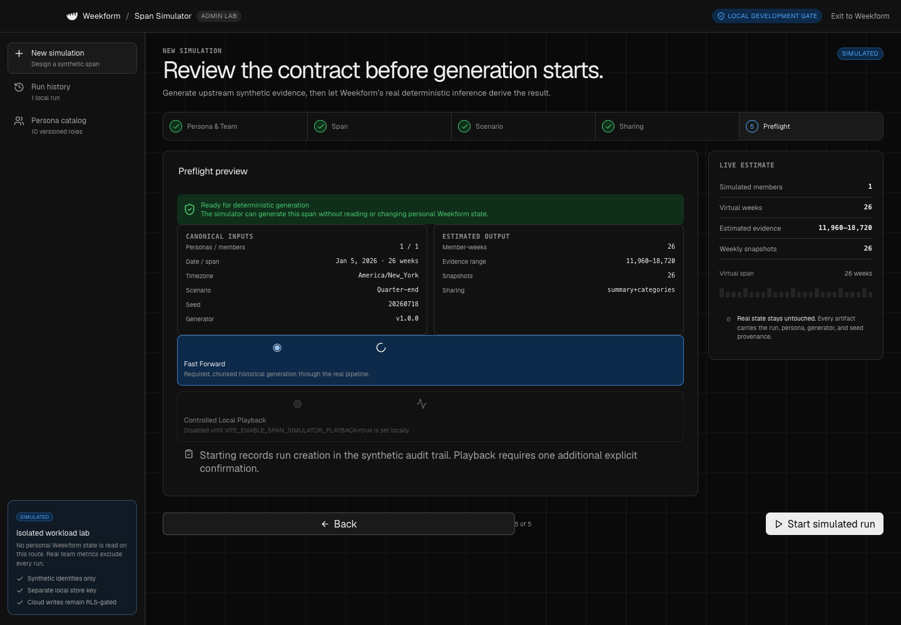
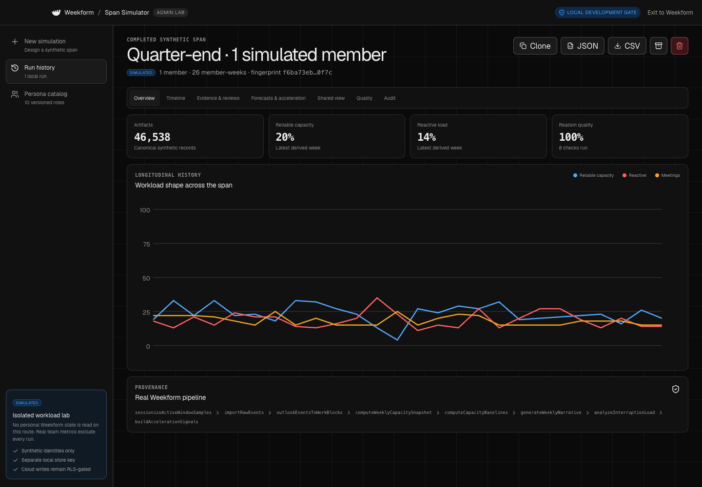

# Weekform Simulation

Weekform Simulation is an administrator-oriented workload laboratory with two complementary functions:

1. **Generate span** deterministically creates clearly synthetic, persona-based duties, communications, business records, and workload evidence across weeks, months, or years, then runs that evidence through Weekform's real deterministic inference code.
2. **Live simulation** replays a short role-specific work loop in local development. A visible synthetic cursor works inside embedded Weekform-owned business sandboxes, returns to Weekform's actual demo UI, reviews a work block, and opens the Week and Forecast surfaces in real time.

Its purpose is product testing, longitudinal scenario review, and safe demonstrations. It is not an employee-monitoring feature, a source of real workforce records, a way to impersonate a person, or an automation bridge to workplace applications.

## Current implementation status

As of July 20, 2026, this repository contains the local Generate span and Live simulation functions, a reviewable Supabase migration, and policy-test SQL. Generate span is the longitudinal engine. Live simulation is a development-only, same-origin demonstration surface; it is not enabled in production builds. The Team Cloud web application described in the planning blueprint is not deployed from this checkout. The migration in `supabase/migrations/202607180001_span_simulator.sql` has not been applied to or verified against a live Supabase project, and the pgTAP-style contract in `supabase/tests/span_simulator_rls.sql` has not been run here because Supabase CLI/local services are unavailable.

Any local Manager Access session in this prototype is a development convenience, not a production authorization boundary. Production cloud simulator access requires an authenticated Supabase user with an explicit row in `private.simulator_admins`; a normal member, team manager, local session marker, environment flag, or user-editable metadata value is insufficient.

Run the isolated local UI with:

```bash
npm run dev
# open http://127.0.0.1:5173/, then choose Settings → Account & Sharing → Manager Access
```

The local Manager Access lab uses a visibly synthetic demo account:

```text
Email: span.admin@example.test
Password: Weekform-Span-2026!
```

The Manager Access entry is automatically available in Settings → Account & Sharing during Vite development. **Open Manager Access** stays on the current local origin; after sign-in, Simulation appears as an isolated synthetic tool. Successful local authentication creates a tab-scoped `sessionStorage` marker so returning to Manager Access retains the session and directly pasting the Simulation URL does not bypass sign-in. Monochrome display preferences use browser `localStorage` and never contain workload evidence or grant access. These published demo credentials and local browser values have no production or cloud access. Live simulation is available only in Vite development and requires explicit per-run confirmation; there is no separate playback environment flag.

## Canonical pipeline

Generate span creates the synthetic work world and upstream evidence before deriving outcomes:

```text
versioned persona + role catalog + versioned scenario + date range + timezone + seed
→ linked role-specific work items, communications, and bounded business records
→ synthetic active-window samples, calendar events, and metadata-only chat events
→ real Weekform sessionizer and source adapters
→ real WorkBlock shapes
→ corrections and review state
→ real weekly capacity snapshots and deterministic narratives
→ forecasts and acceleration signals
→ consent-safe simulated manager snapshots
```

Capacity cards and manager rows must never be authored directly. Each simulated member is run independently through inference; only already-derived, sharing-policy-safe snapshots may be assembled into the isolated manager simulation view. This avoids cross-member source IDs from inflating WIP, fragmentation, or capacity.

Canonical identity is derived from persona version, scenario version, date range, timezone, and seed. Operational timestamps such as “export prepared at” are audit metadata and are excluded from the canonical fingerprint.

## Synthetic identity and provenance

Every persisted generated row carries:

- `is_synthetic = true`, enforced by a database check;
- `simulation_run_id`;
- `persona_version`;
- `generator_version`;
- `seed`.

Member display names must contain `SIMULATED`, and `simulated_badge` is constrained to that exact value. The database validates that member generator/seed markers match their run and that artifact/snapshot markers match their member. JSON and CSV exports repeat the synthetic and provenance markers so data does not become ambiguous after leaving Weekform.

Persona definitions are append-only by `(slug, persona_version)`: changing a persona requires a new version. Members, artifacts, and week snapshots are likewise insert/delete-only for authenticated simulator administrators; revised output comes from a new run rather than an in-place rewrite. Canonical run inputs—including configuration, sharing policy, execution mode, persona/scenario/generator versions, and seed—are immutable after insertion. Only lifecycle state, completion fingerprint, archive state, and their timestamps may advance on an existing run.

Personas describe roles, responsibility patterns, app families, project mixes, meeting behavior, and seasonal pressure. The versioned role catalog adds concrete duties, deliverables, communication patterns, and business measures with plausible synthetic bounds. Work items link to their communications and business records through synthetic identifiers so a reviewer can trace a role-specific activity without treating a derived Weekform metric as authored truth. Personas and catalogs do not contain or derive from real employee profiles. Natural-language scenario direction and custom persona descriptions must stay abstract: do not paste real names, organizations, customers, email addresses, local paths, credentials, calendar text, or window titles.

## Storage isolation

Simulation data has its own cloud tables:

- `simulation_personas`
- `simulation_runs`
- `simulation_members`
- `simulation_artifacts`
- `simulation_week_snapshots`
- `simulation_audit_events`

These tables are not joined or unioned into `workload_snapshots`. The existing desktop `PersistedAppState` and legacy `clear-capacity` store remain the personal local state boundary; the migration does not read or write that store. Raw simulated artifacts must not be copied into personal work blocks, corrections, audit history, retention state, or real team snapshots.

In browser development mode, resumable runs live in a separate IndexedDB database named `weekform-span-simulator`. This avoids both the personal Weekform store and `localStorage` size limits for long canonical datasets. The repository serializes writes so a later week checkpoint cannot be overwritten by an earlier asynchronous write. IndexedDB remains unencrypted local prototype storage.

`simulation_members`, `simulation_artifacts`, and `simulation_week_snapshots` cascade from a run. Permanently deleting a run therefore removes its generated members, raw/derived artifacts, and week snapshots in one transaction. A minimal administrative deletion receipt remains in `simulation_audit_events`; it contains the run identifier, actor, action, generator/persona versions, seed, and status summary, not the deleted workload payload.

## Authorization and RLS

Simulator authorization lives in `private.simulator_admins`, not `team_memberships` or JWT/user metadata. The `private.is_simulator_admin(uuid)` security-definer helper is the single predicate used by RLS.

| Actor | Personas | Runs | Members/artifacts/snapshots | Simulation manager view | Audit receipts |
| --- | --- | --- | --- | --- | --- |
| Anonymous | Denied | Denied | Denied | Denied | Denied |
| Authenticated member | Denied | Denied | Denied | Denied | Denied |
| Team manager without simulator grant | Denied | Denied | Denied | Denied | Denied |
| Explicit simulator admin | Allowed under RLS | Allowed under RLS | Allowed under RLS | Read allowed | Read allowed |
| Trusted database operator/service role | Bootstrap/recovery only | Bootstrap/recovery only | Bootstrap/recovery only | Bootstrap/recovery only | Bootstrap/recovery only |

No policy permits a user to insert themselves into `private.simulator_admins`. Bootstrap an administrator only after the auth user exists, through a trusted database console or service-role process, and record the grant reason. Never ship a service key in the desktop/web bundle.

The migration enables and forces RLS on every public simulation table. The isolated `simulation_manager_snapshots` view uses `security_invoker = true`, so underlying RLS remains effective.

## Manager inclusion behavior

“Include simulations” must default off. The real manager query continues to read only real `workload_snapshots`; enabling the toggle performs a separate query against `simulation_manager_snapshots`. Simulated rows render in a separate planning/demo section with permanent `SIMULATED` treatment. They are never folded into real team totals, rankings, trends, alerts, or briefings.

The toggle is available only after simulator-admin authorization. It is not a mechanism for an ordinary manager to acquire simulator access.

## Validation and forbidden data

The generator and dataset validator must reject real-looking or ambiguous content before persistence/export. Forbidden inputs and generated payloads include:

- real names, employee/customer identifiers, non-reserved email addresses, phone numbers, and account IDs;
- credentials, API keys, access/refresh tokens, cookies, passwords, or signed URLs;
- real window titles, calendar titles, organizer/attendee identities, message bodies, screenshots, and file contents;
- real local paths, repository paths, domains, customer/project names, or copied prompt text;
- any row missing its synthetic/run/persona/generator/seed provenance.

Synthetic window titles may use a small generator-owned catalog such as `SIMULATED dashboard migration`; they must not interpolate arbitrary user input. Synthetic email-like fixtures use reserved domains such as `example.test`. Validation is a safety guard, not a perfect PII detector; admins remain responsible for entering only synthetic context.

Cloud-facing simulated manager snapshots are an allowlist projection. They contain selected metrics, category/work-mode allocations where permitted, review coverage, freshness, and synthetic provenance. They exclude raw samples, sessions, source IDs, evidence arrays, notes, window/file/calendar/chat fields, screenshots, prompts, API configuration, and full audit details.

## Audit, export, archive, and delete

Run creation and status changes produce database audit receipts. Cancellation and archive status changes are distinguishable actions. Export calls `record_simulation_export_prepared`, which truthfully records that a JSON or CSV payload was prepared locally; it does not claim the operating system successfully saved the file. Export files are local downloads and contain synthetic/provenance markers on the envelope and rows.

Archive is reversible and removes the run from the active simulation manager view without deleting artifacts. Permanent delete is destructive and should require an explicit confirmation naming the run. The database cascade is atomic; the retained deletion receipt is deliberately not a recoverable copy of the payload.

The existing personal full-backup/export path is separate and must not silently include simulator tables. Likewise, deleting a simulation run does not reset personal Weekform state, and resetting personal prototype data does not prove cloud simulation rows were deleted.

## Live simulation boundary

Generate span is the long-span function and performs no workplace-app automation. Live simulation is an optional Vite-development function behind the local Manager Access gate and an explicit per-run confirmation.

The live runner builds a validated action plan whose URLs are limited to exact loopback origins on port `5173`: allowlisted Weekform-owned `/simulator-sandbox/` surfaces with a known persona, and an exact Weekform demo URL carrying `demo=1`, `simulator=1`, an allowlisted screen, and a known `simulationPersona`. It rejects external origins, lookalike hosts, `file:`, arbitrary localhost routes, unexpected query parameters, fragments, and navigation supplied by generated page content. Every action is marked synthetic and external mutation is disabled.

The runner executes inside a sandboxed, same-origin iframe and renders its own synthetic cursor overlay. It can click and type only through the allowlisted selectors in that embedded document. It does **not** move the macOS cursor, use AppleScript or OS-wide input automation, launch a dedicated browser profile, capture the foreground window, open external applications, or perform network/workplace mutations. Pause, step, restart, and cancellation operate on the local action sequence; missing selectors and disallowed URLs fail closed.

When the loop returns to Weekform, it opens the actual Weekform application UI in demo mode with persona-shaped synthetic state. The review, navigation, Week, and Forecast interactions use the real UI handlers, but that embedded session is in memory: it does not read or write personal `PersistedAppState`, start capture, import personal sources, sync cloud data, or persist its simulated edits. The same-origin iframe is an observable local demonstration surface, not host-level network isolation and not proof that Weekform automates real workplace applications.

## Demo evidence

The golden Senior Data Analyst scenario was exercised through the local admin workflow using synthetic data only:





## Known limitations

- The underlying capacity conversion uses a fixed 40-hour weekly baseline. PTO and reduced workweeks are modeled as scenario evidence but do not yet redefine that denominator.
- Some existing acceleration/interruption helpers bucket hours and weekdays using the host machine timezone. Until every downstream helper accepts the scenario timezone, identical canonical inputs can produce time-of-day labels that drift across hosts. The validator should report this limitation; do not claim portable timezone determinism yet.
- Capacity weights and realism distributions are prototype heuristics, not organizational benchmarks.
- Local prototype stores are unencrypted. Although simulator data is synthetic, natural-language scenario text can still become sensitive if an administrator ignores the input rules.
- The committed migration and pgTAP contract are review artifacts until applied and run against a real Supabase environment. No RLS result should be reported as live proof from this checkout.
- Live simulation executes only inside embedded Weekform-owned development pages. Its cursor is a visual overlay, not the operating-system cursor, and the local proof does not establish external-application automation or host-level network isolation.

## Verification gates

Before deployment:

1. Apply the migration to a disposable local Supabase project.
2. Run `supabase/tests/span_simulator_rls.sql` and inspect every positive and negative assertion.
3. Prove anonymous, member, team-manager, forged-ID, and user-metadata role paths cannot enumerate or mutate simulation data.
4. Prove explicit simulator admin access, provenance mismatch rejection, isolated view behavior, and cascade deletion.
5. Run deterministic engine tests, the root `npm run build`, `npm audit --audit-level=moderate`, and the golden 26-week scenario.
6. Inspect JSON/CSV exports and the embedded live loop manually with synthetic fixtures only; separately confirm that the Weekform portion remains demo-mode and in-memory.
