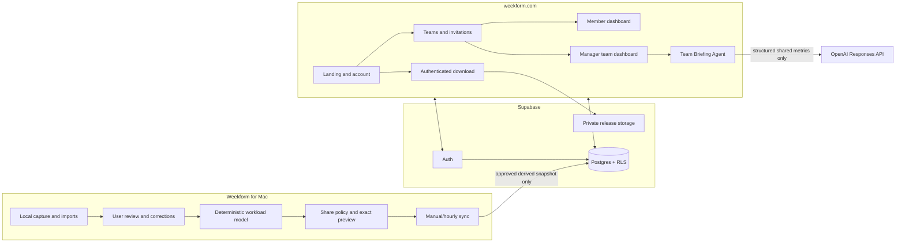

# Weekform Team Clawfather — OpenAI Build Week Hackathon Blueprint

**Prepared:** July 18, 2026  
**Target track:** Work and Productivity  
**Hard submission deadline:** July 21, 2026 at 5:00 PM PDT / 8:00 PM EDT  
**Internal submission target:** July 21, 2026 at 3:00 PM EDT  
**Repository baseline:** `kspringfield13/weekform-dev` at public `main` commit `ae2539666581c23232a4225b377793a57a7a4019`  
**Operating instructions:** repository-root `AGENTS.md`

---

## 1. Executive decision

Weekform should not attempt to become a complete workforce-management platform during the remaining hackathon window. The winning move is to extend its already credible local workload-intelligence engine with one complete, privacy-governed team loop:

```text
create account → create or join a team → install Weekform for Mac
→ review local workload evidence → preview exactly what will be shared
→ approve a derived snapshot → sync to Supabase
→ manager sees team capacity signals → AI produces an evidence-grounded briefing
→ member narrows, pauses, or revokes sharing and the dashboard responds
```

This vertical slice changes Weekform from a polished personal prototype into a specific **Work and Productivity** product for real teams. It demonstrates technical implementation across native macOS, React/TypeScript, Supabase Auth/Postgres/RLS, a web application, scheduled synchronization, privacy controls, and an OpenAI-powered team briefing. It also preserves the product’s essential trust model: raw evidence stays local, every share is user-controlled, and AI explains deterministic metrics rather than inventing them.

### Product statement

> **Weekform gives each teammate private workload intelligence on their Mac and lets them share only approved capacity signals with the people coordinating the work.**

### Submission headline

> **Know what your team can take on—without turning work into surveillance.**

### The demo promise

By the final demo, a judge can:

1. Sign in to `weekform.com` as a manager.
2. Create a team and generate an invitation link.
3. Sign in as a teammate and join the team.
4. Reach an authenticated download page for the Mac app.
5. In Weekform for Mac, sign into the same account, inspect the exact share payload, and approve a sync.
6. Return to the manager dashboard and see the teammate’s approved capacity, reactive load, fragmentation, freshness, and sharing scope.
7. Generate a concise team briefing grounded in those shared metrics.
8. Turn off a metric or all sharing from the Mac and see the manager view honor that decision.

If that loop is reliable, coherent, and visually polished, Weekform has a strong submission. Additional breadth is optional.

---

## 2. Current baseline review

## 2.1 What exists now

Weekform is already a substantial local-first macOS workload-intelligence application, not a blank-slate hackathon concept. Its current flow is:

```text
capture → sessionize → classify → review → model → summarize
```

The repository currently contains:

- A Tauri 2 menu-bar desktop application with a Rust native shell.
- React 18, TypeScript, and Vite frontend code.
- Native foreground-application and window-title sampling on macOS.
- Local Outlook `.ics`, workplace-chat metadata, git-log, and generic-event import paths.
- Reviewable `WorkBlock` records with category, work mode, planned status, project, stakeholder, confidence, evidence, verification, blockers, and notes.
- A deterministic `WeeklyCapacitySnapshot` with allocation, reliable new-work capacity, committed utilization, reactive load, meetings, fragmentation, carryover risk, work-in-progress, context-switch scores, penalties, and category/mode allocations.
- User corrections and a searchable audit history.
- Review Copilot, forecast, narrative, workload Agent, Acceleration plays, reusable Skills, proactive alerts, and AI-usage tracking.
- Local persistence through Tauri Store, with browser storage for web/demo mode.
- Export, retention, pause, reset, and sensitive-capture controls.
- A synthetic demo and a guided source-build installer.
- A documented Build Week provenance trail and Codex session evidence.

The current product already solves the hardest domain problem: it converts incomplete activity signals into **reviewable, explainable workload intelligence**. The cloud extension should reuse that reviewed model rather than shipping raw tracking data.

## 2.2 What does not exist

Repository inspection found no current Supabase integration, cloud authentication, team model, invitations, member roles, cloud synchronization, web account product, or manager dashboard. The current `package.json` contains desktop and AI dependencies but no Supabase or Next.js application. `PersistedAppState` contains local workload, AI, audit, settings, and history state, but no account, team, sharing policy, or sync state.

This means the new concept is a genuine submission-period product extension, but it also creates the largest risk: the team must add a coherent cloud boundary without destabilizing the desktop core.

## 2.3 Baseline strengths

| Area | Assessment | Why it matters now |
|---|---:|---|
| Local workload engine | Strong | The cloud product can ship derived intelligence instead of inventing a new analytics model. |
| Explainability and audit | Strong | Every cloud share can inherit the same evidence and correction philosophy. |
| Privacy posture | Strong locally | A consent-based cloud contract can become the novel product differentiator. |
| Native product experience | Strong prototype | Judges see a real installed tool, not only a dashboard mockup. |
| Agent and automation surfaces | Strong | Team briefing can extend an existing product vocabulary rather than feel bolted on. |
| Synthetic demo support | Strong | Multi-user team scenarios can be repeatable and privacy-safe. |
| Build Week provenance | Strong | New cloud work can be clearly separated from inherited capabilities. |

## 2.4 Baseline weaknesses and technical debt

| Area | Current gap | Hackathon consequence |
|---|---|---|
| Cloud/backend | None | Must establish Supabase project, schema, RLS, and environment contracts immediately. |
| Web product | None | Must build landing, auth, team setup, dashboard, and download flow from scratch. |
| Desktop account model | None | Must add account/sharing without overwhelming `App.tsx` and `SetupScreen.tsx`. |
| Automated tests | No established suite | New privacy payload and RLS boundaries need focused tests rather than broad test infrastructure. |
| Persistence | One large version-1 local blob | New account/sync fields require defensive parsing and migration discipline. |
| Secret storage | Local prototype storage is not encrypted | Persisting a Supabase session must be disclosed; secure Keychain storage is post-hackathon unless rapidly proven. |
| Distribution | Source-build installer; no signed/notarized release | Gate the official source ZIP/app artifact, not the publicly visible repository itself. |
| Module size | Large React/Rust modules | Parallel writers must avoid touching the same high-conflict files. |
| Legacy identifiers | Some `clear-capacity` storage/event identifiers remain | Do not combine identifier cleanup with the cloud critical path. |

## 2.5 Current-to-future product boundary

The current product treats raw activity as local and records `sent_to_cloud: false` in many audit details. A cloud feature changes that claim. The implementation is incomplete until all affected surfaces accurately explain:

- what remains local;
- what can be shared;
- what is shared by default;
- who can see it;
- when the last upload occurred;
- how to preview, pause, revoke, and delete it;
- what happens when the app is closed or offline;
- what the prototype still does not secure.

The cloud layer must be presented as **member-controlled sharing**, not silent telemetry.

---

## 3. Scope recommendation

## 3.1 P0 — required winning slice

The following is the critical path. A submission missing one of these items has an incomplete product story.

1. **Weekform.com foundation**
   - Engaging landing page.
   - Email/password authentication.
   - Authenticated dashboard shell.
   - Role-aware onboarding.

2. **Team management**
   - Manager creates a team.
   - Manager generates a teammate invite link.
   - Teammate accepts after sign-in/sign-up.
   - Membership roles: `owner`, `manager`, `member`.

3. **Authenticated download**
   - User must be authenticated to access the official Mac download page.
   - Download route returns a short-lived signed URL or an authenticated artifact response.
   - The public repository can remain visible; the gate controls the official packaged experience, not source-code DRM.

4. **Desktop account and sharing**
   - Account & Sharing settings in the Mac app.
   - Sign in with the same Supabase account.
   - Select team.
   - Default sharing is off.
   - Exact payload preview before first sync.
   - Share levels: Summary, Categories, Projects.
   - Project names require an explicit allowlist.
   - Manual Sync Now.

5. **Cloud workload snapshot**
   - Only reviewed, derived, aggregated data.
   - Versioned payload contract.
   - Idempotent upsert/insert.
   - RLS-protected rows.
   - Sync receipt and audit event.

6. **Manager team dashboard**
   - Latest shared snapshot per active member.
   - Reliable capacity, reactive load, meeting load, fragmentation, carryover risk, confidence, freshness, and share level.
   - No rankings and no synthetic “performance score.”
   - Missing or stale data is labeled, never interpreted as poor performance.

7. **Privacy control demonstration**
   - User changes sharing scope or disables sharing.
   - Future sync omits the removed fields.
   - User can delete cloud snapshots for a team.
   - Manager view reflects the new state.

8. **Codex/GPT-5.6 evidence and submission package**
   - Dated commits and task/session IDs.
   - README product story and setup.
   - Demo video.
   - Synthetic multi-user seed.
   - Reproducible validation log.

## 3.2 P1 — high-value after the P0 loop works

- Hourly automatic sync while Weekform is running.
- Startup catch-up when the last successful sync is older than one hour.
- Bounded retry and offline state.
- OpenAI-powered Team Briefing with structured output and metric citations.
- Email delivery for invite links; copy-link remains the fallback.
- Team dashboard history across several snapshots.
- Authenticated download analytics limited to product events, not workload data.
- Manager can manage member role or remove membership.

## 3.3 P2 — explicitly deferred

Do not put these on the critical path:

- Billing, subscriptions, or seat limits.
- Enterprise SSO/SCIM.
- HRIS, Jira, Asana, Linear, Slack OAuth, or Teams OAuth.
- Real-time streaming dashboards.
- Raw sessions, window titles, screenshots, calendar titles, notes, or evidence in Supabase.
- Per-minute activity views.
- Manager-enforced sharing policies.
- Employee rankings, benchmarks, utilization league tables, or “productivity scores.”
- Multi-region data residency controls.
- Mobile apps.
- Windows support.
- Full background daemon when the app is quit.
- Notarized updater pipeline if it threatens the vertical slice.
- Deep-link OAuth unless email/password desktop sign-in is already stable.
- Complex multi-organization administration.
- A general-purpose analytics warehouse.

---

## 4. Target architecture



## 4.1 Technology choices

| Concern | Recommended tool | Why this is the fastest credible choice |
|---|---|---|
| Web application | Next.js App Router, TypeScript, deployed on Vercel | Fast auth/server rendering, route handlers, and production deployment. |
| UI | Existing Geist language, CSS variables, shadcn/ui primitives where useful | Keeps desktop/web visually related without building a design system from zero. |
| Auth | Supabase Auth, email/password for P0 | Same identity works on web and desktop; avoids macOS deep-link work. |
| Web sessions | `@supabase/ssr` cookie clients | Official SSR path for Next.js. |
| Desktop data API | `@supabase/supabase-js` with the publishable key and authenticated user session | RLS authorizes direct inserts/reads; no service key in the app. |
| Database | Supabase Postgres | Teams, memberships, invites, snapshots, and RLS in one system. |
| Authorization | Postgres RLS | Enforces own-row writes and manager/team reads even if a client is compromised. |
| Invitations | Weekform `team_invites` table + tokenized accept route/RPC | Works for existing and new accounts; does not depend on Supabase admin invite behavior. |
| Email | Optional Resend/custom SMTP | Helpful but not required for the demo; copy invite link is deterministic. |
| Official download | Private Supabase Storage + short-lived signed URL | Enforces authenticated access to the official artifact. Use source ZIP fallback if app archive is too large. |
| Team AI | Server-side OpenAI Responses API, structured output | Keeps secret key off clients; deterministic metrics remain authoritative. |
| Scheduled upload | Desktop interval/startup catch-up | Only the local app possesses the current approved data; database cron cannot pull from a sleeping Mac. |
| Cloud maintenance | Supabase Cron later | Appropriate for rollups, retention, stale markers, and cleanup—not local collection. |
| Agentic development | Codex with GPT-5.6; Absoloop for isolated evidence-gated missions | Maximizes Build Week evidence while controlling cross-cutting risk. |

## 4.2 Authentication decision

### P0 decision: sign in again in the desktop app

The user creates an account on `weekform.com` before download. After installation, the desktop app asks for the same email/password and obtains its own Supabase session. This is the smallest end-to-end implementation because it avoids custom URI schemes, browser-to-app callbacks, device pairing services, or OAuth deep-link behavior.

Caveat: the prototype currently uses unencrypted local stores. The desktop UI and privacy documentation must say that the saved cloud session is stored locally in prototype storage. A post-hackathon security upgrade should move refresh credentials into macOS Keychain.

### Fallback if desktop password auth blocks integration

Use a one-time device-pairing code:

1. Signed-in web user creates a short-lived code.
2. Desktop enters the code.
3. A server function exchanges it for a revocable, narrowly scoped device token.
4. The token can only write that user’s snapshots and read their memberships.

This is more secure in scope but more custom code. Use it only if the standard Supabase session cannot be made reliable quickly.

## 4.3 Why not deep links during the hackathon

Tauri supports deep links, but macOS registration must be declared in the application configuration and tested in a bundled build. Deep-link auth is a sensible product upgrade, not the fastest P0 dependency. Add it only after the full email/password flow is green.

---

## 5. Privacy-governed cloud contract

## 5.1 Non-negotiable rule

**The cloud never receives the desktop state object or a filtered copy of it.** It receives a separately constructed, versioned `SharedWorkloadSnapshotV1` created by a pure allowlist builder.

This avoids accidental leakage when local models evolve.

## 5.2 Data classification

### Always local

- Foreground app names.
- Window titles.
- Raw active-window samples.
- Activity sessions and source IDs.
- Work-block evidence arrays.
- Notes.
- Calendar titles, locations, organizer names, or attendee identities.
- Chat channels, message text, or raw chat events.
- Screenshots and Visual Context insights.
- AI provider keys.
- Supabase secret/service key.
- Full audit details.
- Generated skill recipes unless separately exported by the user.

### Shareable only by explicit metric toggle

- Reliable new-work capacity.
- Allocated percentage.
- Reactive percentage.
- Meeting percentage.
- Fragmented-work percentage.
- Blocked percentage.
- Carryover-risk percentage.
- Context-switch score.
- Work-in-progress score.
- Summary confidence.
- Review coverage and data freshness.

### Shareable at Categories level

- Category allocation.
- Work-mode allocation.

### Shareable at Projects level

- Project allocation only for names the user explicitly allows.
- Only reviewed work blocks contribute.
- “Unassigned work” is grouped, not expanded.
- No stakeholder names or notes.

## 5.3 Proposed TypeScript contract

```ts
export type CloudShareLevel = "summary" | "categories" | "projects";

export interface CloudMetricPolicy {
  reliableCapacity: boolean;
  allocated: boolean;
  reactive: boolean;
  meetings: boolean;
  fragmented: boolean;
  blocked: boolean;
  carryoverRisk: boolean;
  contextSwitching: boolean;
  workInProgress: boolean;
  confidence: boolean;
}

export interface CloudSharePolicyV1 {
  version: 1;
  enabled: boolean;
  teamId: string | null;
  shareLevel: CloudShareLevel;
  metrics: CloudMetricPolicy;
  allowedProjectNames: string[];
  autoSyncEnabled: boolean;
  intervalMinutes: 60;
  consentedAt: string | null;
}

export interface SharedWorkloadSnapshotV1 {
  schemaVersion: 1;
  clientSnapshotId: string;
  teamId: string;
  weekId: string;
  observedAt: string;
  sourceUpdatedAt: string;
  shareLevel: CloudShareLevel;
  metrics: Partial<{
    reliableNewWorkCapacityPct: number;
    allocatedPct: number;
    reactivePct: number;
    meetingPct: number;
    fragmentedWorkPct: number;
    blockedPct: number;
    carryoverRiskPct: number;
    contextSwitchScore: number;
    wipLoadScore: number;
    summaryConfidence: number;
  }>;
  categoryAllocation?: Array<{ label: string; value: number }>;
  workModeAllocation?: Array<{ label: string; value: number }>;
  projectAllocation?: Array<{ label: string; value: number }>;
  reviewCoverage: {
    reviewedBlocks: number;
    eligibleBlocks: number;
  };
}
```

`user_id` is assigned by the authenticated database write path, not trusted from payload input.

## 5.4 Payload builder requirements

Create a pure function, preferably in `packages/inference/src/sharedSnapshot.ts`:

```ts
buildSharedWorkloadSnapshot({
  snapshot,
  workBlocks,
  policy,
  now,
}): SharedWorkloadSnapshotV1
```

It must:

1. Reject disabled, unconsented, or teamless policies.
2. Include only metrics whose policy flag is true.
3. Omit category/mode arrays below Categories level.
4. Omit project allocation below Projects level.
5. Include only allowlisted project names from user-verified blocks.
6. Clamp and validate finite numeric values.
7. Never serialize unknown fields.
8. Produce a stable client snapshot ID for retry idempotency.
9. Pass tests asserting that forbidden keys and known sensitive strings cannot appear.
10. Return a human-readable preview model generated from the same object that will be uploaded.

## 5.5 Consent UX

Account & Sharing must show:

- Team receiving the data.
- “Sharing is off” by default.
- Last successful sync and last attempt.
- Next scheduled sync while the app is running.
- Exact metrics selected.
- Share level.
- Project allowlist.
- Exact JSON or structured preview.
- Confirmation checkbox: “I reviewed what will be shared with this team.”
- Sync Now.
- Pause sharing.
- Delete shared history.
- Sign out/disconnect.

The user must approve the initial policy. Subsequent policy changes are audited locally and should show a before/after summary.

---

## 6. Supabase data model

## 6.1 Minimum tables

### `profiles`

| Column | Type | Notes |
|---|---|---|
| `id` | uuid PK | References `auth.users(id)`. |
| `display_name` | text | User-controlled. |
| `avatar_url` | text nullable | Optional; defer upload UI. |
| `created_at` | timestamptz | Default now. |
| `updated_at` | timestamptz | Updated by trigger/app. |

### `teams`

| Column | Type | Notes |
|---|---|---|
| `id` | uuid PK | Generated. |
| `name` | text | Required. |
| `created_by` | uuid | Owner. |
| `created_at` | timestamptz | Default now. |
| `updated_at` | timestamptz | Default now. |

### `team_memberships`

| Column | Type | Notes |
|---|---|---|
| `team_id` | uuid | Composite PK. |
| `user_id` | uuid | Composite PK. |
| `role` | text | `owner`, `manager`, `member`. |
| `status` | text | `active`, `removed`. |
| `joined_at` | timestamptz | Default now. |

Authorization comes from this table, not editable user metadata.

### `team_invites`

| Column | Type | Notes |
|---|---|---|
| `id` | uuid PK | Generated. |
| `team_id` | uuid | Target team. |
| `email` | citext/text | Intended recipient. |
| `role` | text | Usually `member`. |
| `token_hash` | text unique | Never store plaintext token. |
| `invited_by` | uuid | Manager/owner. |
| `expires_at` | timestamptz | 72 hours for product invite. |
| `accepted_at` | timestamptz nullable | One-time use. |
| `accepted_by` | uuid nullable | Recipient. |
| `created_at` | timestamptz | Default now. |

The manager route generates a token, stores only its hash, and returns a copyable invite URL. Email delivery is optional.

### `workload_snapshots`

| Column | Type | Notes |
|---|---|---|
| `id` | uuid PK | Server generated. |
| `client_snapshot_id` | uuid unique | Retry idempotency. |
| `schema_version` | int | `1`. |
| `team_id` | uuid | The sharing boundary. |
| `user_id` | uuid | Must equal `auth.uid()` on insert. |
| `week_id` | text | ISO week. |
| `observed_at` | timestamptz | Client observation time. |
| `source_updated_at` | timestamptz | Local data freshness. |
| `share_level` | text | Summary/categories/projects. |
| key metrics | numeric nullable | Queryable manager cards. |
| `category_allocation` | jsonb nullable | Sanitized. |
| `work_mode_allocation` | jsonb nullable | Sanitized. |
| `project_allocation` | jsonb nullable | Allowlisted. |
| `reviewed_blocks` | int | Coverage. |
| `eligible_blocks` | int | Coverage. |
| `created_at` | timestamptz | Server timestamp. |

### Optional `cloud_events`

Use only if the web product needs a minimal sync receipt/history. Do not replicate the desktop audit trail.

## 6.2 Core RLS rules

1. Every exposed table has RLS enabled.
2. A user can read/update their own profile.
3. A user can read profiles of active teammates only for display in shared teams.
4. A member can read teams in which they have an active membership.
5. An owner/manager can update their team and manage invitations/memberships, with safeguards against removing the final owner.
6. A member can read their own membership.
7. Managers can read active membership rows for teams they manage.
8. A user can insert, update, and delete only snapshots where `user_id = auth.uid()` and they have an active membership in `team_id`.
9. A user can read their own snapshots.
10. An owner/manager can read snapshots for members of teams they manage.
11. A regular member cannot read another member’s snapshots.
12. Service/secret keys exist only in trusted server routes/functions.
13. Index every `user_id`, `team_id`, membership, and policy lookup used by RLS.

## 6.3 Views and functions

- `latest_team_snapshots`: one most-recent snapshot per `(team_id, user_id)`, created with `security_invoker = true` or queried directly if view risk/time is high.
- `accept_team_invite(raw_token text)`: security-definer RPC that hashes the token, verifies expiration/email/authenticated user, inserts membership, and marks the invite accepted.
- `create_team_with_owner(name text)`: optional RPC to atomically create the team and owner membership.
- `delete_my_team_snapshots(team_id uuid)`: optional RPC; direct user delete under RLS is sufficient.

## 6.4 Demo seed

Create three synthetic accounts and a team:

- **Manager:** Maya Chen — Northstar Analytics.
- **Member:** Jordan Lee — low headroom, high reactive load.
- **Member:** Sam Rivera — moderate headroom, meeting-heavy.

Never seed real names, credentials, calendar text, or customer data. Store demo credentials in a local ignored file, not the repository.

---

## 7. Web product specification

## 7.1 Recommended repository structure

```text
weekform-dev/
  apps/
    desktop/                 # existing Tauri + React app
    web/                     # new Next.js application
      app/
        (marketing)/
          page.tsx
        (auth)/
          login/page.tsx
          signup/page.tsx
          callback/route.ts
        dashboard/page.tsx
        teams/new/page.tsx
        teams/[teamId]/page.tsx
        invite/[token]/page.tsx
        download/page.tsx
        api/
          invites/route.ts
          download/route.ts
          team-briefing/route.ts
      components/
      lib/
        supabase/client.ts
        supabase/server.ts
        supabase/proxy.ts
        auth.ts
        teamQueries.ts
        briefingSchema.ts
      package.json
  packages/
    domain/src/
      models.ts              # existing
      cloud.ts               # new cloud types
    inference/src/
      sharedSnapshot.ts      # new allowlist builder
      sharedSnapshot.test.ts
  supabase/
    migrations/
    seed.sql
  docs/
    TEAM_CLOUD_ARCHITECTURE.md
    CLOUD_PRIVACY.md
```

Keep root desktop build behavior intact. Add explicit root scripts for `web:dev`, `web:build`, `test:cloud`, and `validate:cloud` instead of silently replacing the existing `build` gate.

## 7.2 Landing page

### Hero

**Headline:** Know what your team can take on—before the work slips.  
**Subhead:** Weekform turns each teammate’s reviewed local workload into the capacity signals they choose to share. No raw activity feed. No invisible monitoring.  
**Primary CTA:** Create your Weekform account  
**Secondary CTA:** See how privacy works

### Sections

1. **The coordination problem** — task systems show assigned work, not the reactive, fragmented, and recurring work consuming the week.
2. **How Weekform works** — local observation, personal review, approved sharing, team coordination.
3. **What managers see** — capacity, risks, freshness, and consent—not screenshots or window titles.
4. **What teammates control** — metric toggles, project allowlist, preview, pause, delete.
5. **Codex-built intelligence** — explain how Codex/GPT-5.6 accelerated the product and how the Agent turns evidence into decisions.
6. **Install flow** — account first, then authenticated download.
7. **Prototype disclosure** — honest limitations.

## 7.3 Role onboarding

After signup:

- “Create a team” → user becomes owner/manager.
- “Join with an invite” → user pastes/opens token.
- “Use Weekform personally” → personal dashboard and download, no team required.

Do not use a permanent global “manager vs user” flag. Roles belong to team memberships, allowing one person to manage one team and be a member of another later.

## 7.4 Manager dashboard

### Header

- Team name.
- Active member count.
- Members sharing current data.
- Last team update.
- Invite button.
- Generate Team Briefing.

### Team overview

- Median reliable capacity and range.
- Members with low reliable headroom.
- Median reactive load.
- Median fragmentation/context switching.
- Meeting load range.
- Sharing freshness.

Do not sum percentages across people and label the result “team capacity.” Use medians, ranges, counts, and explicit per-member cards.

### Member cards

- Display name.
- Last sync/freshness.
- Share level.
- Selected metrics.
- Reliable capacity.
- Reactive/meeting/fragmentation indicators.
- Confidence/review coverage.
- “Not shared” states for omitted fields.
- Link to a simple member detail/history view only if P0 is stable.

### Team risks

Deterministic heuristics, clearly labeled as planning flags:

- Reliable capacity below threshold.
- Reactive load above threshold.
- Carryover risk above threshold.
- Fragmentation above threshold.
- Data older than 24 hours.
- Review coverage below threshold.

These are conversation starters, not performance conclusions.

## 7.5 Member web dashboard

- Personal latest shared snapshot.
- Teams and roles.
- Download/reinstall button.
- Last desktop sync.
- Current share level and metric names.
- “Change sharing in Weekform for Mac” guidance.
- Leave team.
- Delete cloud history.
- Privacy explanation.

## 7.6 Invitations

P0 behavior:

1. Manager enters email.
2. Server route creates a random token and stores its hash.
3. UI presents a copyable invite link.
4. Optional email send occurs if SMTP/Resend is configured.
5. Recipient signs in or signs up.
6. Invite route calls acceptance RPC.
7. Membership appears in dashboard.

This custom invitation is superior to using the Auth Admin invite as the team model because it works for both existing and new confirmed users.

## 7.7 Authenticated download

- `/download` requires a session.
- Server route checks user profile.
- Route returns a signed private-storage URL lasting 5–10 minutes.
- Artifact can be the source ZIP containing `scripts/install.command` for the hackathon.
- Show macOS requirements and privacy permissions before download.
- Track only `download_requested`/version/account ID if desired; no workload data.

If private storage or artifact size blocks delivery, fall back to an authenticated download page that provides the current public source archive while honestly describing the limitation. Do not fake enforcement.

---

## 8. Desktop implementation specification

## 8.1 New Account & Sharing settings tab

Update `SettingsTab` and `SetupScreen` with an `account-sharing` tab positioned first or second. Extract its UI into `CloudAccountPanel.tsx` to avoid further expanding the already large settings component.

### Signed-out state

- Explanation that account creation begins on weekform.com.
- Open weekform.com button.
- Email/password sign-in form.
- Connection status.
- Prototype storage disclosure.

### Signed-in state

- Email/display name.
- Teams and current team selector.
- Sharing off/on.
- Share level.
- Metric toggles.
- Project allowlist.
- Auto-sync toggle.
- Preview.
- Sync Now.
- Last success/attempt/error.
- Delete cloud history.
- Sign out.

## 8.2 New desktop modules

```text
apps/desktop/src/
  services/
    cloudClient.ts           # Supabase client, auth, memberships, snapshot upsert/delete
  hooks/
    useCloudAccount.ts       # session and membership state
    useCloudSync.ts          # payload, schedule, retries, receipts
  components/settings/
    CloudAccountPanel.tsx
    SharePreview.tsx
```

If time is tight, `useCloudAccount` and `useCloudSync` can be one hook, but keep pure payload construction outside React.

## 8.3 Persistence changes

Add to `PersistedAppState`:

```ts
cloudSharePolicy: CloudSharePolicyV1;
cloudSyncState: {
  lastAttemptAt: string | null;
  lastSuccessAt: string | null;
  lastClientSnapshotId: string | null;
  lastError: string | null;
  retryCount: number;
};
```

Do not persist the Supabase secret key. The publishable key is build configuration. The authenticated session storage mechanism must be explicit and cleared by Reset Local Data or Disconnect Account.

Requirements:

- Defensive parser for every added field.
- Version/migration behavior for existing version-1 state.
- Full-backup decision: include policy and sync metadata, but not refresh/access tokens.
- Reset clears policy, session, and sync metadata.
- New local audit event types for account connection, policy change, sync, sync failure, cloud delete, and disconnect.

## 8.4 Manual sync behavior

`syncNow()` should:

1. Verify signed-in user.
2. Verify active team membership.
3. Verify sharing enabled and consent timestamp.
4. Build the exact snapshot with the pure builder.
5. Validate it.
6. Show/retain the preview hash.
7. Upsert to `workload_snapshots` with authenticated Supabase client.
8. Record last attempt/success.
9. Emit a local audit event containing team ID, schema version, share level, metric names, payload hash, row ID, and result—but not the payload itself.
10. Show a clear toast.

## 8.5 Hourly sync behavior

P1 implementation:

- Interval: 60 minutes.
- Only while the app process is running.
- On startup/resume, sync if the last success is more than 60 minutes old and data/policy changed.
- Do not sync in demo mode unless a dedicated cloud-demo flag is enabled.
- Do not sync while tracking is paused solely because tracking is paused; share policy is separate. However, if no local data changed, do not create redundant snapshots.
- Retry after approximately 1, 5, and 15 minutes, capped.
- Stop retrying after sign-out, policy disable, membership loss, or invalid auth.
- Reuse the same `clientSnapshotId` during retries.
- Generate a new snapshot ID only when the approved payload changes.
- Treat app closure as no schedule guarantee; state this in UI.

## 8.6 Data-change fingerprint

Create a stable fingerprint of:

- snapshot values actually selected by policy;
- selected category/mode/project arrays;
- policy version;
- team ID;
- review coverage.

If the fingerprint matches the last successful sync, update freshness only if product requirements demand it; otherwise avoid a redundant row.

## 8.7 Desktop audit language

Examples:

- “Connected Weekform account locally.”
- “Enabled team sharing for Northstar Analytics.”
- “Shared 7 approved metrics and category allocation.”
- “Cloud sync failed; no local data was removed.”
- “Deleted shared workload history for Northstar Analytics.”
- “Disconnected Weekform account and stopped future uploads.”

Never say “all data synced.”

---

## 9. Team Briefing Agent specification

## 9.1 Purpose

The Team Briefing Agent helps a manager prepare a capacity conversation using only data members chose to share. It does not score people, diagnose burnout, or allocate work automatically.

## 9.2 Input

Server-side route receives:

- Team name.
- Current time/window.
- Latest permitted snapshots.
- Share level and freshness per member.
- Deterministic team aggregates.
- Deterministic risk flags.

No raw titles, evidence, notes, screenshots, local audit trail, API credentials, or unshared fields.

## 9.3 Structured output

```ts
interface TeamBriefingResult {
  headline: string;
  summary: string;
  sharedEvidenceCoverage: string;
  risks: Array<{
    title: string;
    explanation: string;
    evidenceRefs: string[];
  }>;
  coordinationOpportunities: Array<{
    title: string;
    action: string;
    evidenceRefs: string[];
  }>;
  questionsForTheTeam: string[];
  limitations: string[];
}
```

## 9.4 System instruction

The Agent must:

- Use only provided facts.
- Distinguish absent data from zero.
- Mention stale or partial sharing.
- Avoid employee comparison language.
- Avoid mental-health, medical, legal, or HR conclusions.
- Avoid recommending disciplinary action.
- Prefer team/process interventions: protect focus time, reduce meetings, rebalance committed work, clarify priorities, batch reactive requests.
- Cite metric/member snapshot references.
- State that results are planning aids requiring human conversation.

## 9.5 Runtime model

Use a current GPT-5.6 model through the Responses API if available in the account and verified against current official model documentation. Configure the ID through `OPENAI_TEAM_BRIEFING_MODEL`; do not guess or freeze an unverified model ID. Use structured output and `store: false` where supported.

Deterministic SQL/TypeScript computes metrics. The model explains and synthesizes; it does not calculate the source of truth.

---

## 10. Repository file-impact map

| Existing path | Planned change | Conflict risk |
|---|---|---:|
| `packages/domain/src/models.ts` | Add audit-event variants if cloud types are not separated. Prefer `cloud.ts`. | Medium |
| `packages/domain/src/cloud.ts` | New cloud account, policy, payload, sync-state types. | Low |
| `packages/inference/src/sharedSnapshot.ts` | Pure privacy allowlist builder. | Low |
| `packages/inference/src/sharedSnapshot.test.ts` | Privacy/contract tests. | Low |
| `apps/desktop/src/services/localStore.ts` | Add defensive cloud fields/migration. | High |
| `apps/desktop/src/App.tsx` | Compose cloud hooks, persistence, audit, reset, props. | Very high |
| `apps/desktop/src/lib/types.ts` | Add account-sharing settings tab. | Low |
| `apps/desktop/src/lib/audit.ts` | Cloud audit helpers. | Medium |
| `apps/desktop/src/services/cloudClient.ts` | New Supabase/auth/data service. | Low |
| `apps/desktop/src/hooks/useCloudSync.ts` | New sync state machine. | Low |
| `apps/desktop/src/components/settings/CloudAccountPanel.tsx` | New settings UI. | Low |
| `apps/desktop/src/components/settings/SetupScreen.tsx` | Mount new panel/tab and props. | High |
| `apps/desktop/src/components/shell/ScreenRouter.tsx` | Thread cloud props to settings. | High |
| `apps/desktop/src/services/demoData.ts` | Optional cloud demo state; default should stay offline. | Medium |
| `apps/desktop/src/lib/dataExport.ts` | Backup policy/sync metadata, exclude tokens. | Medium |
| `apps/desktop/src-tauri/src/lib.rs` | Avoid for P0 unless secure storage/native network is required. | High |
| `package.json` / lock | Supabase, web scripts, focused test command. | Medium |
| `.env.example` | Separate desktop publishable and web/server secrets. | Low |
| `apps/web/**` | Entire web product. | Low relative to desktop |
| `supabase/**` | Migrations, seed, optional functions. | Low |
| `docs/PRIVACY.md` | New cloud data flow and limitations. | Medium |
| `docs/BUILD_WEEK_2026.md` | Dated new work and Codex evidence. | Medium |
| `README.md` | Team-cloud story, install/account/demo. | Medium |

### Parallel-writing rule

Only one desktop implementation agent may own `App.tsx`, `SetupScreen.tsx`, `ScreenRouter.tsx`, and `localStore.ts` at a time. Schema, shared contract, web app, docs, and read-only review can run in parallel.

---

## 11. Phased schedule

## Phase 0 — Baseline and contract freeze

**Saturday, July 18 — maximum 3 hours**

Deliverables:

- Baseline report and exact commit.
- P0/P1/P2 scope locked.
- Shared snapshot contract locked.
- Supabase schema/RLS plan locked.
- Web/desktop environment names locked.
- Demo users/team story locked.
- Task board created.
- Branch/worktree ownership assigned.

Exit gate:

- Everyone can explain exactly what crosses the cloud boundary.
- No implementation prompt contains “improve the app” or another open-ended objective.
- P0 can be demonstrated in under four minutes.

## Phase 1 — Foundations in parallel

**Saturday evening through Sunday morning, July 18–19**

### Workstream A: shared contract

- Cloud types.
- Snapshot builder.
- Preview builder.
- Privacy tests.

### Workstream B: Supabase

- Project initialization.
- Tables, indexes, functions, RLS.
- Seed data.
- Policy verification.

### Workstream C: web foundation

- Next.js app.
- Geist styling.
- Landing.
- Auth.
- Dashboard route protection.
- Profile bootstrap.

### Workstream D: desktop plan-only

- Exact hook/service/persistence design.
- No competing writer until contract is merged.

Exit gate:

- Web signup/login works.
- A user can create a profile.
- RLS denies anonymous data access.
- Pure builder tests prove sensitive keys cannot enter payload.
- Contract is merged before desktop/web team queries depend on it.

## Phase 2 — Team and manual sync vertical slice

**Sunday, July 19**

### Web

- Create team.
- Owner membership.
- Invite-link generation.
- Invite acceptance.
- Personal/manager dashboard shells.

### Desktop

- Account & Sharing tab.
- Supabase sign-in.
- Team membership list.
- Sharing policy.
- Exact preview.
- Manual Sync Now.
- Local audit and reset behavior.

### Integration

- Manager dashboard reads latest snapshot.
- Synthetic teammate appears.
- User removes a metric and resyncs.

Exit gate:

- One real desktop-authenticated synthetic account can upload one derived snapshot through RLS.
- Manager account can read it only through valid team role.
- Member account cannot read another member’s snapshot.
- Payload contains none of the forbidden fields.

## Phase 3 — Product completeness

**Monday, July 20**

- Hourly scheduling/startup catch-up.
- Retry/offline UX.
- Team aggregates and risk flags.
- Team Briefing Agent.
- Authenticated download.
- Invite email optional.
- Member delete/revoke.
- Landing polish.
- Responsive/accessibility pass.
- Cloud privacy docs.
- Synthetic three-user demo reset script.

**Internal feature freeze: Monday, July 20 at 9:00 PM EDT.**

Exit gate:

- Complete golden path works twice from fresh state.
- Desktop and web production builds pass.
- RLS matrix passes.
- No P0 TODOs.
- Demo can be performed without editing the database manually.

## Phase 4 — Submission hardening

**Tuesday, July 21**

### 8:00 AM–12:00 PM EDT

- Clean installs/builds.
- End-to-end regression.
- Accessibility and error-state smoke test.
- Privacy/security critic.
- Fix only blockers.

### 12:00–3:00 PM EDT

- Capture demo video.
- Edit captions and concise narration.
- Final screenshots.
- README and Devpost copy.
- Update Build Week provenance and session IDs.
- Secret scan.

### 3:00 PM EDT

- Internal submission deadline.
- Verify repository access, video URL, description, track, `/feedback` value, setup instructions, and final commit.

### 8:00 PM EDT

- Official hard deadline. This is not the working target.

---

## 12. Work breakdown and estimates

Estimates are focused-engineering hours, not calendar duration. Parallel work reduces elapsed time.

| ID | Task | Owner | Depends on | Est. | Priority |
|---|---|---|---|---:|---|
| P0-01 | Freeze baseline and scope | Program integrator | — | 1.0h | P0 |
| P0-02 | Freeze share contract/privacy matrix | Domain architect | P0-01 | 1.5h | P0 |
| P0-03 | Create Supabase project/env inventory | Cloud lead | P0-01 | 0.5h | P0 |
| C-01 | Write migration and RLS | Cloud lead | P0-02 | 3.0h | P0 |
| C-02 | Add invite acceptance RPC | Cloud lead | C-01 | 1.5h | P0 |
| C-03 | Seed synthetic team | Cloud lead | C-01 | 1.0h | P0 |
| D-01 | Add cloud domain types | Contract lead | P0-02 | 1.0h | P0 |
| D-02 | Build snapshot allowlist function | Contract lead | D-01 | 2.0h | P0 |
| D-03 | Add privacy tests | Contract lead | D-02 | 1.5h | P0 |
| W-01 | Scaffold Next/Supabase SSR app | Web lead | P0-03 | 1.5h | P0 |
| W-02 | Landing page | Web lead | W-01 | 2.5h | P0 |
| W-03 | Signup/login/profile | Web lead | W-01,C-01 | 2.5h | P0 |
| W-04 | Create team/onboarding | Web lead | W-03,C-01 | 2.0h | P0 |
| W-05 | Invite link/accept | Web lead | W-04,C-02 | 2.5h | P0 |
| W-06 | Manager dashboard query/UI | Web lead | W-04,C-01 | 4.0h | P0 |
| W-07 | Member dashboard | Web lead | W-03,C-01 | 2.0h | P0 |
| W-08 | Authenticated download | Web lead | W-03 | 1.5h | P0 |
| M-01 | Desktop Supabase client/auth hook | Desktop lead | W-03,D-01 | 2.5h | P0 |
| M-02 | Account & Sharing UI | Desktop lead | M-01,D-01 | 4.0h | P0 |
| M-03 | Persistence/parsers/reset/export | Desktop lead | M-01,D-01 | 3.0h | P0 |
| M-04 | Manual sync and audit | Desktop lead | M-02,M-03,D-02,C-01 | 3.5h | P0 |
| I-01 | End-to-end account/team/sync test | Integrator | W-06,M-04 | 2.0h | P0 |
| I-02 | Revoke/delete flow | Web + desktop | I-01 | 2.0h | P0 |
| P1-01 | Hourly/startup sync | Desktop lead | I-01 | 2.5h | P1 |
| P1-02 | Retry/offline state | Desktop lead | P1-01 | 1.5h | P1 |
| P1-03 | Team aggregate/risk helpers | Web lead | W-06 | 2.0h | P1 |
| P1-04 | Team Briefing Agent | AI lead | P1-03 | 3.0h | P1 |
| P1-05 | Optional invite email | Web lead | W-05 | 1.0h | P1 |
| Q-01 | RLS negative-test matrix | Security critic | C-01,W-06 | 2.0h | P0 |
| Q-02 | Privacy payload review | Security critic | D-03,M-04 | 1.5h | P0 |
| Q-03 | Web/native accessibility smoke | UX critic | I-01 | 1.5h | P0 |
| R-01 | Production web build/deploy | Release lead | W-08,I-01 | 1.5h | P0 |
| R-02 | Desktop build/artifact | Release lead | M-04 | 2.0h | P0 |
| R-03 | Demo seed/reset | Demo lead | I-02 | 1.5h | P0 |
| R-04 | Video/README/Devpost/provenance | Submission lead | R-01,R-02,R-03 | 5.0h | P0 |

---

## 13. Coordinated agent execution model

## 13.1 Agent roles

| Agent | Mode | Responsibility | May write |
|---|---|---|---|
| Program Director | Codex Plan / read-only first | Baseline, dependencies, task ledger, integration decisions. | Planning docs only until approved. |
| Contract Agent | Codex | Cloud types, payload builder, privacy tests. | `packages/domain`, `packages/inference`. |
| Cloud Agent | Codex | Supabase schema, RLS, seed, acceptance functions. | `supabase/**`. |
| Web Agent | Codex | Next app, auth, teams, dashboards, download. | `apps/web/**`. |
| Desktop Agent | Codex | Account/sharing/sync and high-conflict desktop files. | Desktop paths only; sole writer. |
| AI Agent | Codex | Team Briefing schema, route, prompt, safe rendering. | Isolated web AI files. |
| Privacy Critic | Separate read-only Codex task or different-provider Absoloop reviewer | Disprove RLS/payload/privacy claims. | Findings only. |
| Integrator | Codex with high effort | Merge contracts, resolve conflicts, run builds, preserve golden path. | Integration branch. |
| Demo/Submission Agent | Codex | Seed, scripts, README, video script, Devpost copy, provenance. | Demo/docs only. |

## 13.2 Safe parallel wave

After the contract freeze, run these simultaneously:

- Contract Agent.
- Cloud Agent.
- Web foundation Agent.
- Demo narrative Agent in read-only planning mode.

Do **not** start the desktop writer until the cloud types and table names are stable. Do not run two desktop writers.

## 13.3 Codex effort selection

Verify model availability in the installed Codex client. Recommended posture:

- GPT-5.6 Sol with high/max effort: architecture, privacy, RLS, desktop integration, final review.
- GPT-5.6 Sol medium: product UI and feature implementation.
- GPT-5.6 Terra: narrow tests, docs, fixtures, and mechanical follow-up.
- GPT-5.6 Luna: fast search/check/format tasks where risk is low.
- Ultra/multi-agent mode, if available: initial architecture synthesis or final cross-surface integration review—not every task.

## 13.4 Absoloop use

Use the repository’s existing Absoloop rules:

- `absoloop run --provider codex` for a coherent isolated slice.
- `absoloop build --strategy council` for schema/contract ambiguity only.
- Cross-provider review for RLS/privacy if available.
- Inspect candidates and gates before apply.
- Keep Weekform and Absoloop source changes separate.

A proposed project `absoloop.toml` should add real Weekform gates:

```toml
[permissions]
default_profile = "edit"

[gates]
required = ["desktop_build", "web_build"]

[gates.commands]
desktop_build = "npm run build"
web_build = "npm run web:build"
cloud_tests = "npm run test:cloud"
rust = "cargo check --manifest-path apps/desktop/src-tauri/Cargo.toml"
audit = "npm audit --audit-level=moderate"
```

Per-task missions should require only applicable gates, but the final integration requires all five.

---

## 14. Validation plan

## 14.1 Contract tests

Required test cases:

1. Summary level includes only enabled numeric metrics.
2. Categories level includes category/mode arrays but no project data.
3. Projects level includes only allowlisted names from reviewed blocks.
4. Window-title sentinel never appears in JSON.
5. Evidence sentinel never appears.
6. Notes sentinel never appears.
7. Disabled metrics are omitted, not set to zero.
8. NaN/infinite values are rejected or normalized safely.
9. Retry preserves client snapshot ID.
10. Policy change changes the fingerprint.

## 14.2 RLS matrix

Test with Manager A, Member B, Member C, Outsider D:

| Operation | A | B | C | D |
|---|---:|---:|---:|---:|
| B inserts B snapshot | N/A | Allow | Deny | Deny |
| B reads B snapshot | Allow as team manager | Allow | Deny unless manager | Deny |
| C reads B snapshot | Deny as member | — | Deny | Deny |
| A reads B snapshot | Allow | — | — | Deny |
| A creates invite for team | Allow | Deny | Deny | Deny |
| B creates invite | Deny | Deny | — | Deny |
| D lists team | Deny | — | — | Deny |
| B deletes B history | — | Allow | Deny | Deny |
| A deletes B history | Deny by default | — | — | Deny |

Also test expired, reused, wrong-email, and already-accepted invites.

## 14.3 Desktop checks

- Existing `npm run build`.
- `cargo check --manifest-path apps/desktop/src-tauri/Cargo.toml` if native files change.
- Existing demo still works with no Supabase configuration.
- App starts signed out and sharing off.
- Existing local-only workflow remains usable.
- Reset clears cloud session/policy.
- Sign-out stops scheduled sync.
- Offline failure preserves local state.
- No cloud env variables are treated as secrets when they are publishable keys.
- No secret/service key appears in desktop bundle.

## 14.4 Web checks

- Production build.
- Unauthenticated protected-route redirects.
- Auth callback/session refresh.
- Role-aware dashboard.
- Responsive 1280px and mobile layout.
- Keyboard navigation and focus states.
- Empty, stale, partial-share, loading, and error states.
- Signed download URL expires.
- Service/secret key only in server environment.

## 14.5 End-to-end golden path

Run twice from a clean synthetic state:

1. Manager creates team.
2. Manager invites member.
3. Member accepts.
4. Member downloads app.
5. Member signs into desktop.
6. Member previews Summary + Categories payload.
7. Member syncs.
8. Manager sees snapshot.
9. Manager generates briefing.
10. Member disables reactive metric.
11. Member syncs.
12. Manager sees “Not shared” for reactive metric.
13. Member deletes cloud history.
14. Manager sees no current shared snapshot.

Capture evidence: screenshots, console-safe logs, database row IDs, gate results, and final commits. Never capture real private data.

---

## 15. Risk register and contingencies

| Risk | Probability | Impact | Prevention | Deadline fallback |
|---|---:|---:|---|---|
| Scope explosion | High | Critical | P0 freeze and one vertical slice. | Cut P1 immediately. |
| Desktop auth session unreliable | Medium | High | Email/password, standard Supabase client, focused smoke. | One-time pairing code or manually entered short-lived token. |
| RLS mistake exposes data | Medium | Critical | Negative matrix and read-only critic. | Demo-only server routes with strict server checks; do not ship direct table access until fixed. |
| Invite email fails | High | Medium | Custom invite table and copy link. | Copy link only. |
| Private download artifact too large | Medium | Medium | Use source ZIP or verify bucket limits early. | Auth page links to source installer and documents prototype limitation. |
| Web/desktop contracts drift | Medium | High | Merge shared types/builder first. | Freeze JSON schema and validate server-side. |
| `App.tsx` conflicts | High | High | One desktop writer. | Integrator applies changes serially. |
| Existing desktop regresses | Medium | Critical | Cloud opt-in and demo without env. | Feature flag cloud UI; preserve local app. |
| Hourly sync misses while app closed | High | Low for demo | Honest label “while Weekform is running.” | Manual Sync Now is P0. |
| Manager dashboard feels surveillant | Medium | Critical product risk | No raw data/rankings; consent states visible. | Remove individual detail and show team-level aggregates only. |
| OpenAI response is ungrounded | Medium | High | Structured input/output and evidence refs. | Deterministic briefing without AI. |
| Deployment/domain delay | Medium | High | Deploy to Vercel preview immediately. | Submit preview URL; connect weekform.com later. |
| macOS build/signing blocks | Medium | High | Keep guided source installer. | Authenticated source ZIP. |
| Demo email confirmations slow | Medium | Medium | Pre-create synthetic accounts and verify SMTP/config. | Use confirmed seed accounts. |
| Deadline overrun | High | Critical | Feature freeze July 20, internal submission 3 PM EDT July 21. | Submit stable vertical slice; omit unfinished P1. |

### Kill criteria

Stop or defer a feature when:

- it has consumed twice its estimate without a P0 demo artifact;
- it requires changing the privacy contract after Phase 1;
- it introduces a second writer into desktop integration files;
- it cannot be tested with synthetic data;
- it weakens an RLS or validation gate;
- it does not improve the judge-facing golden path.

---

## 16. Demo and judging strategy

## 16.1 Four-minute demo

**0:00–0:30 — Problem**  
Task tools show assigned work, but not the reactive requests, meetings, fragmentation, and carryover consuming a team’s actual week.

**0:30–1:00 — Local intelligence**  
Show Weekform for Mac grouping local signals into reviewed work blocks and an explainable capacity view.

**1:00–1:40 — Consent**  
Open Account & Sharing. Show that sharing is off. Choose Summary + Categories. Preview the exact payload. Point out that window titles, raw activity, evidence, and screenshots are absent. Sync.

**1:40–2:30 — Team view**  
Open weekform.com as manager. Show team members, freshness, reliable capacity, reactive load, fragmentation, and partial-sharing states.

**2:30–3:10 — Team Briefing Agent**  
Generate a briefing. Show metric references and coordination questions, not rankings.

**3:10–3:40 — User control**  
Turn off a metric or delete cloud history on the Mac. Refresh manager dashboard. The information disappears or becomes “Not shared.”

**3:40–4:00 — Codex and impact**  
Explain that Codex/GPT-5.6 helped map the pre-existing desktop system, design the privacy contract, implement native/web/backend changes in parallel, review RLS, run gates, and preserve the evidence trail.

## 16.2 Judging-criteria mapping

| Criterion | What the demo proves |
|---|---|
| Technological implementation | Tauri/Rust + React/TS + Next.js + Supabase Auth/Postgres/RLS + scheduled sync + structured OpenAI output + Codex evidence. |
| Design | Coherent local-to-cloud experience, role onboarding, polished manager/member views, real error/empty/consent states. |
| Potential impact | Teams can plan capacity using actual reviewed workload without deploying invasive central monitoring. |
| Quality of idea | Local-first, user-governed team intelligence is distinct from task trackers and employee surveillance products. |

## 16.3 Submission proof list

- Public repository and final commit.
- Build Week baseline/new-work explanation.
- Primary Codex `/feedback` session ID and supplemental task IDs.
- Demo video.
- Live web URL.
- Synthetic account/demo instructions.
- Mac installer/source ZIP instructions.
- Privacy data-flow diagram.
- Screenshots of local review, share preview, manager dashboard, and revocation.
- Validation commands and outcomes.

---

## 17. Post-hackathon expansion roadmap

## Horizon 1 — Trustworthy team planning

- Secure macOS Keychain session storage.
- Deep-link/browser pairing.
- Notarized signed distribution and updater.
- Multiple per-team share policies.
- Weekly history and trend explanations.
- Manager planning scenarios: “What can the team absorb?”
- Consent receipts and cloud retention controls.
- Team-level forecasting calibrated against outcomes.

## Horizon 2 — Workload operations

- Slack/Teams/Jira/Linear integrations that remain metadata-minimal.
- Team planning rituals and weekly review workflows.
- Project/stakeholder demand mapping.
- Capacity reservations and scenario comparison.
- Manager action follow-through and measured outcomes.
- Role-based client views.
- Team-level Acceleration plays and reusable skills.

## Horizon 3 — Workload Intelligence & Sustainable Performance platform

- Multi-team organizations and portfolios.
- Customer-controlled data residency.
- Advanced policy administration that never overrides member consent.
- Organization-wide patterns with privacy thresholds and aggregation minimums.
- Benchmarking against the team’s own history—not opaque global worker rankings.
- Explainable resource planning APIs.
- Workflow automation driven by approved team signals.
- Outcome learning: did meeting reduction, work rebalancing, or automation improve delivery reliability?

The long-term moat is not activity collection. It is the closed learning loop:

```text
private evidence → reviewed truth → safe shared signal → coordinated decision
→ approved action → measured outcome → better personal and team baseline
```

---

## 18. Definition of done

The hackathon blueprint is complete only when:

- The current local-only Weekform experience still works without cloud configuration.
- Account creation precedes the official download.
- A manager can create a team and invite a member.
- A member can join and sign into the Mac app.
- Sharing defaults off.
- The uploaded payload is generated by an explicit allowlist builder.
- A user previews and approves the exact payload.
- At least one real Supabase-authenticated snapshot reaches Postgres under RLS.
- A manager can see it; another member and an outsider cannot.
- No forbidden local field appears in the payload or database.
- Manager dashboard handles omitted/stale data honestly.
- The Team Briefing Agent is grounded and limitation-aware, or a deterministic fallback exists.
- Revocation/deletion works and is demonstrated.
- Web and desktop production builds pass.
- Applicable Rust and dependency checks pass.
- Golden path passes twice from clean synthetic state.
- README, privacy docs, demo, and provenance match the implementation.
- The stable submission is entered before the internal deadline.

---

## 19. Immediate next actions

Execute in this order:

1. Create `docs/hackathon/TEAM_CLOUD_BASELINE.md` from the baseline-mapper prompt.
2. Create `packages/domain/src/cloud.ts` and lock `SharedWorkloadSnapshotV1`.
3. Create the Supabase project and apply the first reviewed migration.
4. Scaffold `apps/web` with Supabase SSR auth and deploy the empty shell immediately.
5. Implement and test the pure share-payload builder.
6. Build team creation/invite acceptance on the web.
7. Assign one desktop writer to Account & Sharing and Manual Sync.
8. Integrate one synthetic account end to end before polishing either UI.
9. Add manager dashboard and revocation.
10. Only then add hourly sync, Team Briefing, email, and visual polish.

The companion files in this blueprint pack provide the copy/paste Codex prompts, execution board, and draft Supabase migration.
